# 1.MyBatis

## 1.简介

原始jdbc的操作

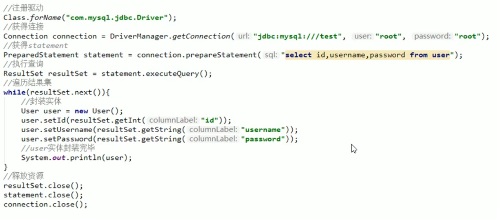

原始jdbc代码的缺点，每次都要创建Connection对象，每次用完之后都要销毁，这样是非常消耗程序的资源的。

还有就是sql语句是嵌入到程序当中的，会造成耦合。 

原始jdbc存在的问题如下：

1. 数据库连接创建，释放频繁造成系统资源从而影响系统性能

2. sql语句在代码中硬编码，造成代码不易维护，实际应用sql变化的可能较大，sql变动需要改变java代码。

3. 查询操作时，需要手动将结果集中的数据手动封装到实体中。插入操作时，需要手动将实体的数据设置到sql语句的占位符位置

   应对上述问题给出的解决方案：

   1. 使用数据库连接池初始化连接资源

   2. 将sql语句抽取到xml配置文件中

   3. 使用反射，内省等底层技术，自动将实体与表进行属性与字段的自动映射

      

## 2. MyBatis

1. mybatis是一个优秀的基于Java的持久层框架，它内部封装了jdbc,使开发者只需要关注sql语句本身，而不需要花费精力去处理驱动，创建连接，创建statement等复杂的过程。
2. mybatis通过xml或注解的方式将要执行的各种statement配置起来，并通过java对象和statement中sql的动态参数进行映射生成最终执行的sql语句
3. 最后Mybatis框架执行sql并将结果映射为java对象并返回。采用了ORM思想解决了实体和书库映射的问题，对jdbc进行了封装，屏蔽了jdbc api底层访问细节，使我们不用与jdbc api打交道，就可以完成对数据库的持久化操作。


总结：

1. 持久的框架

2. 隐藏jdbc繁杂的api

3. 只需关注sql

4. 自动完成实体与数据库的映射

5. 是一个dao层的解决方案

   

## 3.Mybatis开发的步骤

1. 添加Mybatis坐标
2. 创建user数据表
3. 编辑User实体类
4. 编写映射文件UserMapper.xml：内部主要写sql语句
5. 编写核心文件SqlMapConfig.xml：配置mybatis的核心配置
6. 编写测试类


1. 导入坐标

   ```xml
   <dependency>
       <groupId>mysql</groupId>
       <artifactId>mysql-connector-java</artifactId>
       <version>8.0.22</version>
   </dependency>
   <dependency>
       <groupId>org.mybatis</groupId>
       <artifactId>mybatis</artifactId>
       <version>3.4.6</version>
   </dependency>
   ```

2. 编写映射文件UserMapper.xml

   

```xml
<?xml version="1.0" encoding="UTF-8" ?>
<!DOCTYPE mapper PUBLIC "-//mybatis.org//DTD Mapper 3.0//EN" "http://mybatis.org/dtd/mybatis-3-mapper.dtd">
<mapper namespace="userMapper">
    <select id="findAll" resultType="com.baoliang.domain.User">
        select  * from user
    </select>
</mapper>
```

namespace 是命名空间，因为一个mapper中可以有许多的sql标签例如<select>等，可以通过 命名空间.sql标签id来调用，resultType是告诉mybatis最终查询结果要封装到哪里。

当数据库中字段名称与实体属性名称不同怎么办？

https://www.cnblogs.com/fps2tao/p/13901292.html


**如果根据条件查询就得加一个ParameterType**

2. 编写核心配置文件SqlMapConfig.xml

   ```xml
   <?xml version="1.0" encoding="UTF-8" ?>
   <!DOCTYPE configuration PUBLIC "-//mybatis.org//DTD Config 3.0//EN" "http://mybatis.org/dtd/mybatis-3-config.dtd">
   <configuration>
   <!--    配置数据源的环境-->
   <!--    加了s表示可以配置很多个环境,default为默认环境-->
       <environments default="development">
           <environment id="development">
               <transactionManager type="JDBC"></transactionManager>
               <dataSource type="POOLED">
                   <property name="driver" value="com.mysql.cj.jdbc.Driver"/>
                   <property name="url" value="jdbc:mysql://localhost:3306/test?serverTimezone=UTC"/>
                   <property name="username" value="root"/>
                   <property name="password" value="123"/>
               </dataSource>
           </environment>
       </environments>
   <!--    加载映射文件,核心文件加载映射文件-->
       <mappers>
           <mapper resource="com/baoliang/mapper/UserMapper.xml"/>
       </mappers>
   </configuration>
   ```

   3. 编写测试类

      

```java
import com.baoliang.domain.User;
import org.apache.ibatis.io.Resources;
import org.apache.ibatis.session.SqlSession;
import org.apache.ibatis.session.SqlSessionFactory;
import org.apache.ibatis.session.SqlSessionFactoryBuilder;
import org.junit.Test;

import java.io.IOException;
import java.io.InputStream;
import java.util.List;

public class mybatis {
    @Test
    public void test1() throws IOException {
        //加载核心配置文件
        InputStream resourceAsStream = Resources.getResourceAsStream("sqlMapConfig.xml");
        //获得session工厂对象
        SqlSessionFactory sqlSessionFactory = new SqlSessionFactoryBuilder().build(resourceAsStream);
        //获得session会话对象
        SqlSession sqlSession = sqlSessionFactory.openSession();
        //执行操作 参数就是sql配置文件中namespace.id
        List<User> userList = sqlSession.selectList("userMapper.findAll");
        System.out.println(userList);
        //释放资源
        sqlSession.close();
    }
}
```

 

sqlSession.selectList表示查询一个集合

在Java中如何获取配置文件的路径：1.使用类加载器，它只能读取类路径的配置文件

   2. 使用ServletContext对象的getRealPath()方法

      Mybatis解析配置文件使用的是dom4j解析的

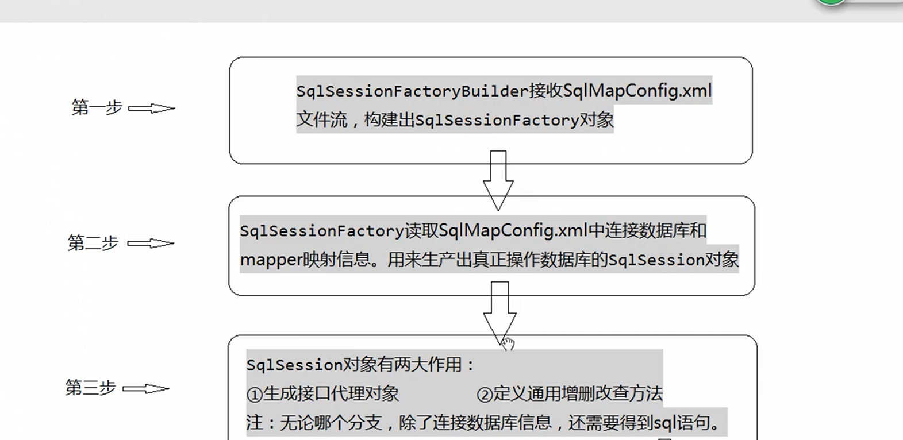


 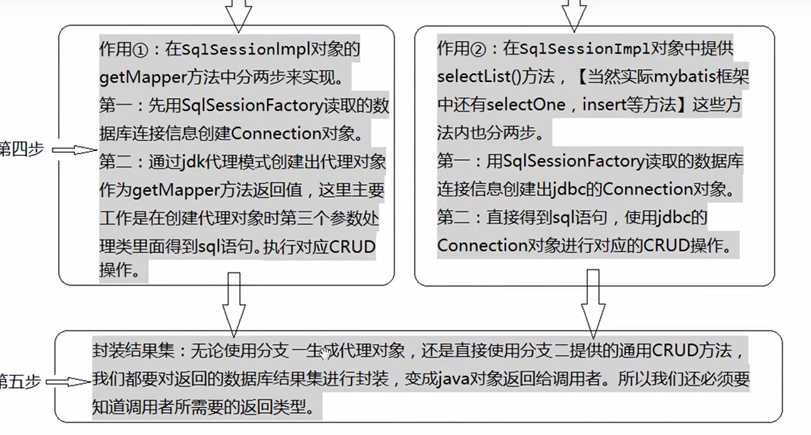

'


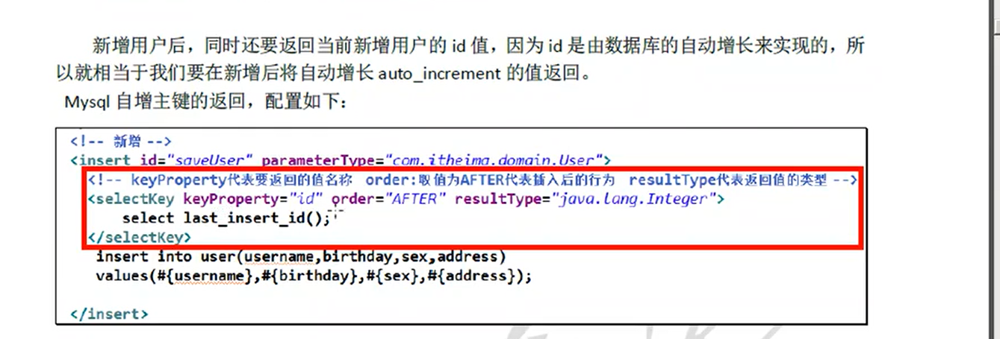

OGNL表达式

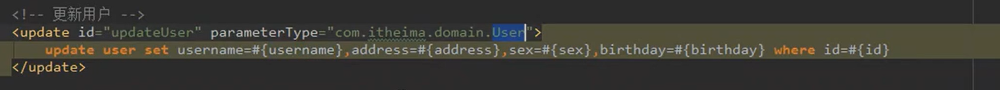

普通的写法是user.getUsername()而ognl表达式user.username.

上图中parmeterTyper中已经提供了前缀，所以直接在下面使用username 就行


# 根据多个 对象的查询条件进行查询

用一个对象包装其他对象。

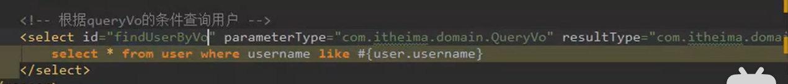

QueryVO中包装了好几个对象，可以使用ognl表达式进行取出来

# 解决实体属性与数据库名称不匹配问题

1. sql语句中起个别名

2. 采用配置方法，配置resultMap映射

   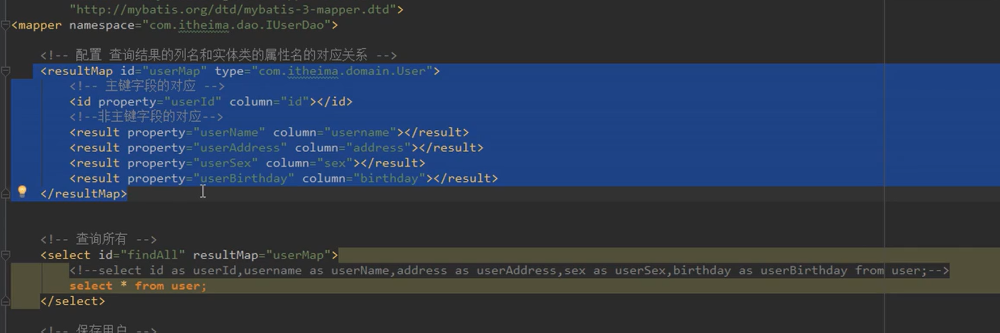

properties中可以使用URL


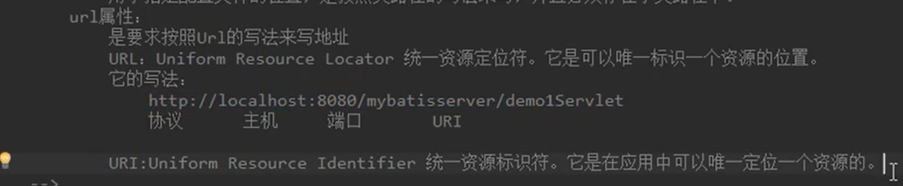

配置完typeAliases后再使用，大小写都行

可以使用package

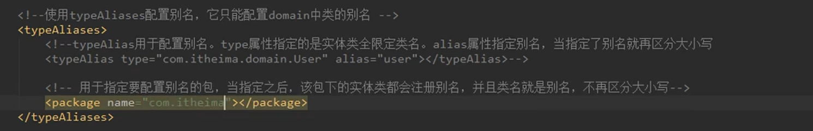

<mappers>也可以用

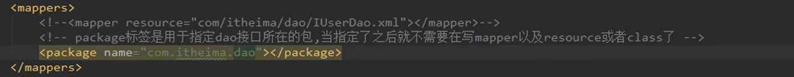

## 4.映射文件的概述

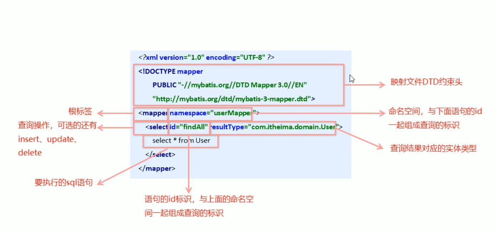

## 5.Mybatis增删改操作

sql映射文件

```xml
<mapper namespace="userMapper">

<!--   注意#里面写的是User对象的属性名称，并不是数据库中的属性名称-->
    <update id="save" parameterType="com.baoliang.domain.User">
        insert into user values (#{id},#{username},#{password})
    </update>
</mapper>
```

上面sql语句中的占位符不再是?而是#{},注意{}里面写的User实体的属性并非数据库中的属性。

在select标签中有一个resultType是结果类型，而这里是parameterType，传入的对象类型。


java类中

```java
//模拟User对象
User user=new User();
user.setUsername("Tom");
user.setPassword("123");

//加载核心配置文件
InputStream resourceAsStream = Resources.getResourceAsStream("sqlMapConfig.xml");
//获得session工厂对象
SqlSessionFactory sqlSessionFactory = new SqlSessionFactoryBuilder().build(resourceAsStream);
//获得session会话对象
SqlSession sqlSession = sqlSessionFactory.openSession();
//执行操作 参数就是sql配置文件中namespace.id
sqlSession.insert("userMapper.save",user);
//执行更新操做，提交事务
sqlSession.commit();
//释放资源
sqlSession.close();
```

需要注意的是Mybatis默认是事务不提交的，所以我们要进行commit().否则数据库不会更改，还有一点就是虽然在不写commit的情况下执行数据库不会更改，但是当我们设置主键自增的时候，执行后数据库不会改变但是sql已经到了数库，此时主键已经自增了，所以当我们再次执行代码进行插入的时候，主键就不是上一条+1了例如下面Tom

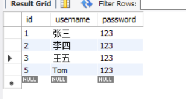

涉及数据库更改的时候要进行事务的提交 ，查询不用事务提交，因为不更改数据库，但是后面再openSession的时候可以设置自动提交

## 6.MyBatis的修改操作

```xml
<update id="update" parameterType="com.baoliang.domain.User">
    update user set username=#{username},password=#{password} where id=#{id}
</update>
```

java代码

```java
//模拟User对象
User user=new User();
user.setId(5);
user.setUsername("Tom");
user.setPassword("4567");
//加载核心配置文件
InputStream resourceAsStream = Resources.getResourceAsStream("sqlMapConfig.xml");
//获得session工厂对象
SqlSessionFactory sqlSessionFactory = new SqlSessionFactoryBuilder().build(resourceAsStream);
//获得session会话对象
SqlSession sqlSession = sqlSessionFactory.openSession();
//执行操作 参数就是sql配置文件中namespace.id
sqlSession.update("userMapper.update",user);
sqlSession.commit();
//释放资源
sqlSession.close();
```

## 7.删除操作

映射文件

```xml
<delete id="delete" parameterType="java.lang.Integer">
    delete from user where id=#{id}
</delete>
```

上面的id=#{}括号中可以随便写，写xxx都行，因为只有一个值

还有一个注意的parameterType是我们传递的内容，我们传递的为int型，所以写java基本包

java文件

```java
//加载核心配置文件
InputStream resourceAsStream = Resources.getResourceAsStream("sqlMapConfig.xml");
//获得session工厂对象
SqlSessionFactory sqlSessionFactory = new SqlSessionFactoryBuilder().build(resourceAsStream);
//获得session会话对象
SqlSession sqlSession = sqlSessionFactory.openSession();
//执行操作 参数就是sql配置文件中namespace.id
sqlSession.update("userMapper.delete",5);
sqlSession.commit();
//释放资源
sqlSession.close();
```

 

## 8.MyBatis核心配置文件讲解

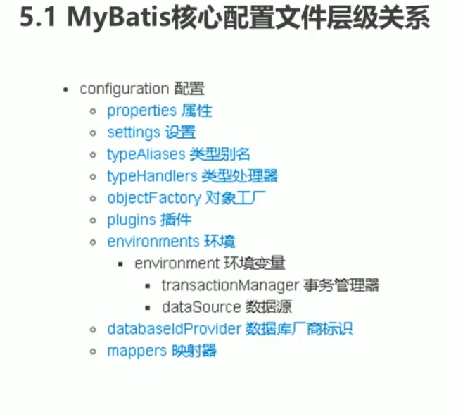

### 1.environment标签

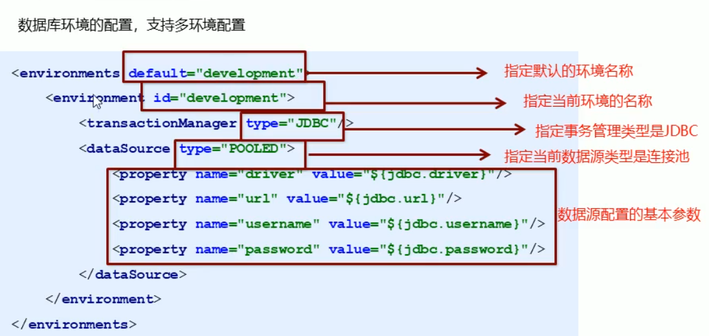

其中，事务管理器（transactionManager）类型有两种：

1. JDBC：这个配置就是直接使用了JDBC的提交和回滚设置，它依赖于从数据源得到的连接来管理事务的作用域。实际就是从JDBC拿Connection进行操作
2. MANAGED：这个配置几乎没做什么。它从来不提交获回滚一个连接，而是让容器来管理整个生命周期（比如JEE应用服务器的上下文）。默认情况下它会关闭连接，然而一些容器并不希望这样，因此需要将closeConnection属性设置为false来阻止它的默认行为

其中，数据源（dataSource）类型有三种：

1. UNPOOLED:这个数据源的实现只是每次被请求时打开和关闭连接
2. POOLED:这种数据源的实现利用"池"的概念将JDBC连接对象组织起来
3. JNDI：这个数据源的实现是为了能在如EJB或应用服务器这类容器中使用，容器可以集中或在外部配置数据源，然后繁殖一个JNDI山下文引用。

### 2.mapper标签

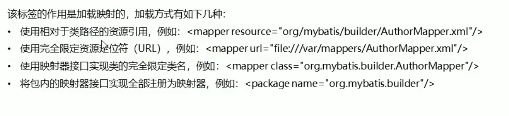

### 3.properties标签

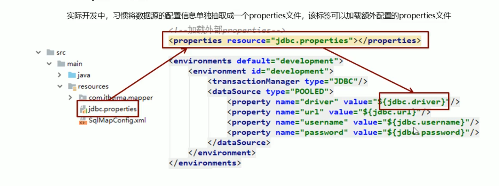

### 4.typeAliases标签

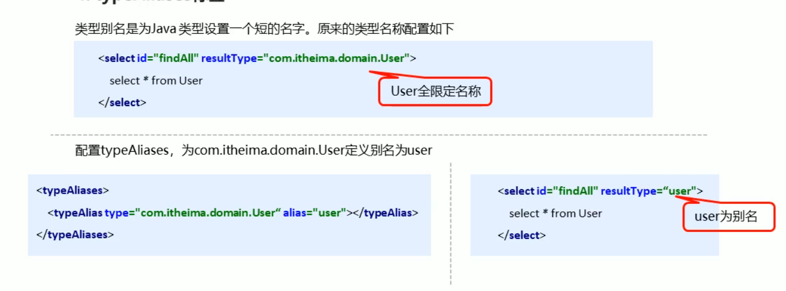

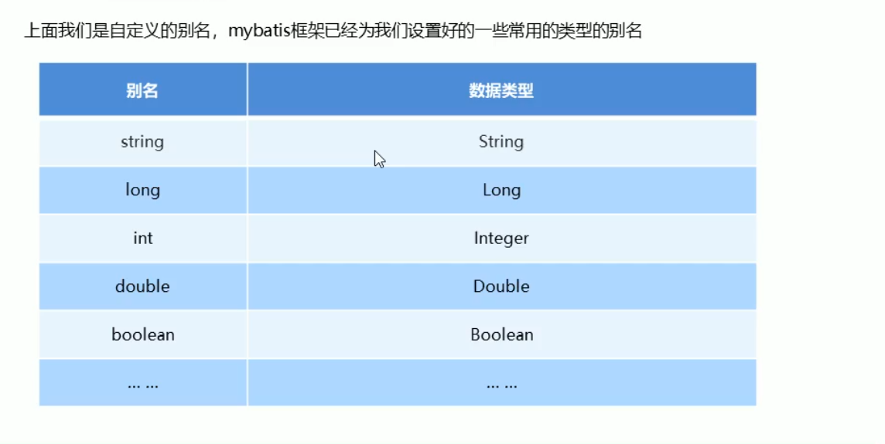

mybatis已经定义了许多默认的别名

自定义别名

在核心映射文件中

```xml
<typeAliases>
    <typeAlias type="com.baoliang.domain.User" alias="user"/>
    ........可以定义一堆别名,方便操作
</typeAliases>
```

注意DTD文件的标签是由顺序的，这个放在prperties和settings后面

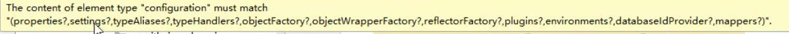

顺序如上

还可以进行扫包，扫包后的别名是实体类的名称或者首字母小写的名称都行例如Account或者account

## 9.MyBatis相应的API

### 1.SqlSession工厂构建器SqlSessionFactoryBuilder

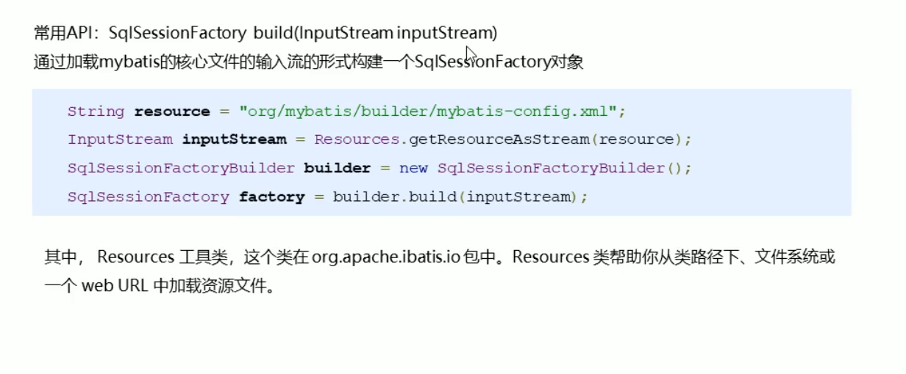

上图中resource相对于类加载路径的。如果是maven工程，则相对于resource路径下的

### 2.SqlSession工厂对象SqlSessionFactory

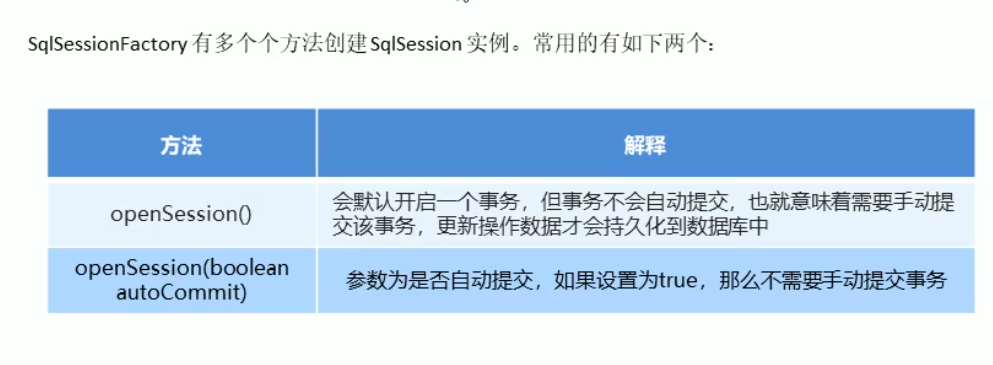

 

### 3.SqlSession会话对象

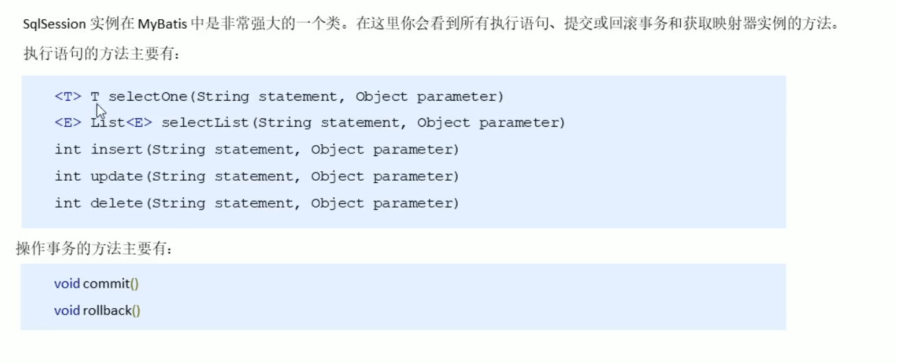

# 2. MyBatis的Dao层的实现

MyBatis是在Dao层的

## 1.传统方式

dao层

```java
public List<User> findAll() throws IOException {

    InputStream resourceAsStream = Resources.getResourceAsStream("sqlMapconfig.xml");
    SqlSessionFactory sqlSessionFactory = new SqlSessionFactoryBuilder().build(resourceAsStream);
    SqlSession sqlSession = sqlSessionFactory.openSession();
    List<User> userList = sqlSession.selectList("userMapper.findAll");
    return userList;
}
```

service测试类

```java
public static void main(String[] args) throws IOException {
    UserMapper userMapper =new UserMapperImpl();
    List<User> all = userMapper.findAll();
    System.out.println(all);
}
```

其他配置跟上一节一样，传统方式跟上一节差不多

从上面看出传统方式繁琐 

## 2.接口代理实现方式

采用Mybatis的代理开发方式实现DAO层的开发，这种方式是我们后面进入企业的主流。

**Mapper接口开发方法只需要程序员编写Mapper接口（相当于Dao接口），由MyBatis框架根据接口定义创建接口的动态代理对象，代理对象的方法同上边Dao接口实现类方法。**

Mapper接口开发需要遵循以下规范：

1. Mapper.xml文件中的namespace与mapper接口的全限定名相同
2. Mapper接口方法名和Mapper.xml中定义的每个statement的id相同
3. Mapper接口方法的输入参数类型和mapper.*-xml中定义的每个sql的parameterType的类型相同
4. Mapper接口方法的输出类型和mapper.xml中定义的每个sql的resultType相同

对应的图例

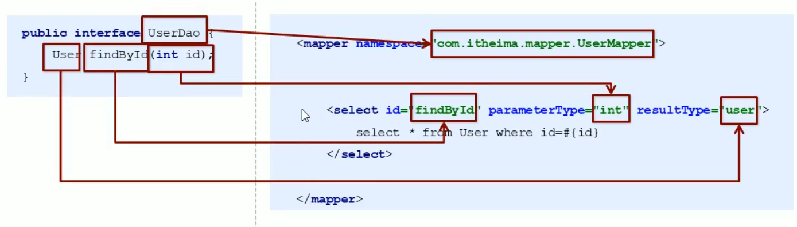

然后在代码中通过sqlSession.getMapper(UserMapper.class)获取UserMapper（这是个接口）类型的对象，由代理生成对象。

## 3.Mybatis映射文件深入

 ## 1.动态sql

### 1.if标签

UserMapper.xml中

```xml
<!DOCTYPE mapper PUBLIC "-//mybatis.org//DTD Mapper 3.0//EN" "http://mybatis.org/dtd/mybatis-3-mapper.dtd">
<mapper namespace="com.baoliang.mapper.UserMapper">
    <select id="findByCondition" parameterType="user" resultType="user">
        select * from user 
        <where>
        <if test="id!=0">
            and id=#{id}
        </if>
        <if test="username!=null">
            and username=#{username}
        </if>
        <if test="password!=null">
            password=#{password}
        </if>
        </where>

    </select>

</mapper>
```

mapper接口

```java
public interface UserMapper {
    public List<User> findByCondition(User user);
}
```

测试代码

```java
 public void test1() throws IOException {
        InputStream resourceAsStream = Resources.getResourceAsStream("sqlMapConfig.xml");
        SqlSessionFactory SqlsessionFactory = new SqlSessionFactoryBuilder().build(resourceAsStream);
        SqlSession sqlSession = SqlsessionFactory.openSession();
        UserMapper mapper = sqlSession.getMapper(UserMapper.class);

        //模拟一下条件
        User condition=new User();
        condition.setId(1);
//        condition.setUsername("张三");
//        condition.setPassword("123");
        List<User> userlist = mapper.findByCondition(condition);
        System.out.println(userlist);

    }
```

注意上面的查询条件中condition已经注释掉了后两个，如果使用<select>标签，里面写select * from user wehere id=#{id} and username=#{username} and password=#{password}这样查询出来的因为条件不全查询出来的为空，而使用if标签可以动态的生成sql

### 2.foreach标签

应用场景就是查询条件为or，就是 条件1 or  条件2 or 条件3

UserMapper.xml

```xml
<select id="findByIds" parameterType="list" resultType="user">
    select * from user
    <where>
        <foreach collection="list" open="id in(" close=")" item="id" separator=",">
            #{id}
        </foreach>
    </where>
</select>
```

注意foreach标签 ，collection标签表示参数的类型,open指的是slect * from user 后面接的语句，close指的是变量后面接的是什么，item指的是变量的名称，这个变量名称随便起，不过下边要一样，separator指的是遍历集合的时候每个变量中间的分隔符是什么。#{id}其中的id就指的是item变量名

java测试代码

```java
InputStream resourceAsStream = Resources.getResourceAsStream("sqlMapConfig.xml");
SqlSessionFactory SqlsessionFactory = new SqlSessionFactoryBuilder().build(resourceAsStream);
SqlSession sqlSession = SqlsessionFactory.openSession();
UserMapper mapper = sqlSession.getMapper(UserMapper.class);

List<Integer> ids=new ArrayList<Integer>();
ids.add(1);
List<User> userList =mapper.findByIds(ids);
System.out.println(userList);
```

### 3.sql片段的抽取

UserMapper.xml

```xml
<?xml version="1.0" encoding="UTF-8" ?>
<!DOCTYPE mapper PUBLIC "-//mybatis.org//DTD Mapper 3.0//EN" "http://mybatis.org/dtd/mybatis-3-mapper.dtd">
<mapper namespace="com.baoliang.mapper.UserMapper">

    <sql id="selectUser">//注意这里抽取了下面标签中相同的部分
        select * from user
    </sql>

    <select id="findByCondition" parameterType="user" resultType="user">
            <include refid="selectUser"></include>//这里进行了引用
        <where>
        <if test="id!=0">
            and id=#{id}
        </if>
        <if test="username!=null">
            and username=#{username}
        </if>
        <if test="password!=null">
            password=#{password}
        </if>
        </where>
    </select>
    
    <select id="findByIds" parameterType="list" resultType="user">
        <include refid="selectUser"></include>//这里进行了引用
        <where>
            <foreach collection="list" open="id in(" close=")" item="id" separator=",">
                #{id}
            </foreach>
        </where>
    </select>

</mapper>
```

# 3. Mybatis核心配置文件的深入

## 1.typeHandlers标签

在使用MyBatis预处理语句查询的时候或者设置某个参数的时候，从结果集中取出一个值的时候，都会用类型处理器将获取的值以合适的方式转换成Java类型。但有的时候有些类型是默认处理器没有的因此需要我们自己去定义。

下面是MyBatis默认的类型处理器

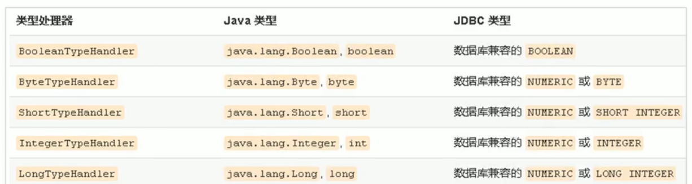


解决类型问题方法

你可以重写类型处理器或者创建自己的类型处理器来处理不支持的或非标准的类型。具体的做法为：实现org.apache.ibatis.type.TypeHandler接口，或者继承一个很便利的类org.apache.ibatis.type.BaseTypeHandler，然后可以选择性地将它映射到一个JDBC类型。例如需求：一个Java中的Date数据类型，我想将之存储到数据库的时候存成一个1970年至今的毫秒数，取出来的时候转换成java的Date，即java的Date与数据库的varchar毫秒值之间的转换

步骤

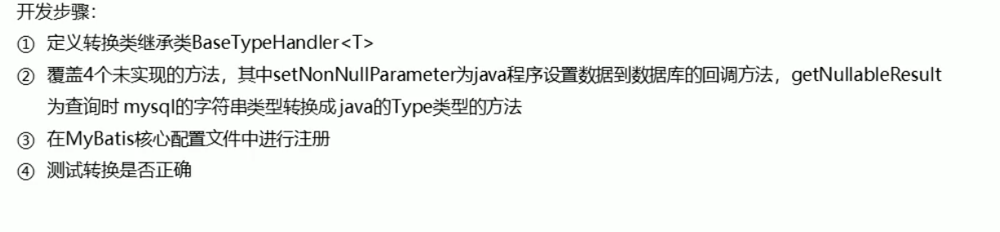

1. 自定义继承转换类

   

```java
package com.baoliang.handler;

import org.apache.ibatis.type.BaseTypeHandler;
import org.apache.ibatis.type.JdbcType;

import java.sql.CallableStatement;
import java.sql.PreparedStatement;
import java.sql.ResultSet;
import java.sql.SQLException;
import java.util.Date;

public class DateTypeHandler extends BaseTypeHandler<Date> {
    //将Java类型转换成数据库需要类型
    //preparedStatement 帮你执行的
    //i是当前数据的位置
    //date是要转换的参数
    @Override
    public void setNonNullParameter(PreparedStatement preparedStatement, int i, Date date, JdbcType jdbcType) throws SQLException {
        long time=date.getTime();
        preparedStatement.setLong(i,time);
    }
    //剩下的三个方法将数据库类型转换成Java需要类型
    //String参数 要转换的字段名称
    //ResultSet查询出的结果集
    @Override
    public Date getNullableResult(ResultSet resultSet, String s) throws SQLException {
        //获取结果集中需要的数据(long),将器转换成Date类型 返回
        long along=resultSet.getLong(s);//取出数据
        Date date=new Date(along);//转换数据
        return date;
    }

    @Override
    public Date getNullableResult(ResultSet resultSet, int i) throws SQLException {
        long along=resultSet.getLong(i);
        Date date=new Date(along);
        return date;

    }

    @Override
    public Date getNullableResult(CallableStatement callableStatement, int i) throws SQLException {
        long aLong = callableStatement.getLong(i);
        Date date=new Date(aLong);
        return date;
    }
}
```

映射文件

```xml
<?xml version="1.0" encoding="UTF-8" ?>
<!DOCTYPE mapper PUBLIC "-//mybatis.org//DTD Mapper 3.0//EN" "http://mybatis.org/dtd/mybatis-3-mapper.dtd">
<mapper namespace="com.baoliang.mapper.UserMapper">
     <insert id="save" parameterType="user">
         insert into user values(#{id},#{username},#{password},#{birthday})
     </insert>
    <select id="findByid" parameterType="int" resultType="user">
        select  * from user where id=#{id}
    </select>

</mapper>
```

java文件

```java
InputStream resourceAsStream = Resources.getResourceAsStream("sqlMapperConfig.xml");
SqlSessionFactory sessionFactory = new SqlSessionFactoryBuilder().build(resourceAsStream);
SqlSession sqlSession = sessionFactory.openSession();
UserMapper mapper = sqlSession.getMapper(UserMapper.class);

User user=new User();
user.setUsername("小华");
user.setPassword("123");

user.setBirthday(new Date());
mapper.save(user);
sqlSession.commit();
sqlSession.close();
```

## 2.plugins标签

MyBatis可以使用第三方的插件来对功能进行扩展，分页助手PageHelper是将分页的复杂操作进行封装，使用简单的方式即可获得分页的相关数据

开发步骤：

1. 导入通用PageHelper的坐标

   ```xml
   <dependency>
       <groupId>com.github.pagehelper</groupId>
       <artifactId>pagehelper</artifactId>
       <version>5.2.0</version>
   </dependency>
   
   <dependency>
       <groupId>com.github.jsqlparser</groupId>
       <artifactId>jsqlparser</artifactId>
       <version>3.2</version>
   </dependency>
   ```

2. 在mybatis核心配置文件中配置PageHelper插件

   ```xml
   <!--    配置分页助手插件-->
       <plugins>
           <plugin interceptor="com.github.pagehelper.PageHelper">
   <!--           不同的数据库使用的结构话查询语言是不同的 -->
               <property name="dialect" value="mysql"/>
           </plugin>
       </plugins>
   ```

3. 测试分页数据获取

   

```java
InputStream resourceAsStream = Resources.getResourceAsStream("sqlMapperConfig.xml");
SqlSessionFactory sessionFactory = new SqlSessionFactoryBuilder().build(resourceAsStream);
SqlSession sqlSession = sessionFactory.openSession();
UserMapper mapper = sqlSession.getMapper(UserMapper.class);
//设置分页的相关参数 需要当前页和每一页显示的条数
PageHelper.startPage(2,3);//其中第一个参数是第几页，第二个参数是每页显示几条数据
List<User> user=mapper.findAll();
for(User us:user){
    System.out.println(us);
}
sqlSession.commit();
sqlSession.close();
```


补充：获取与分页相关的信息

```java
InputStream resourceAsStream = Resources.getResourceAsStream("sqlMapperConfig.xml");
SqlSessionFactory sessionFactory = new SqlSessionFactoryBuilder().build(resourceAsStream);
SqlSession sqlSession = sessionFactory.openSession();
UserMapper mapper = sqlSession.getMapper(UserMapper.class);
//设置分页的相关参数 需要当前页和每一页显示的条数
PageHelper.startPage(2,3);
List<User> user=mapper.findAll();
for(User us:user){
    System.out.println(us);
}
//获取与分页相关的信息
PageInfo<User> pageInfo=new PageInfo<>(user);
System.out.println("当前页"+pageInfo.getPageNum());
System.out.println("每页显示条数"+pageInfo.getPageSize());
System.out.println("总条数"+pageInfo.getTotal());
System.out.println("总页数"+pageInfo.getPages());
System.out.println("上一页"+pageInfo.getPrePage());
System.out.println("下一页"+pageInfo.getNextPage());
System.out.println("是否是第一页"+pageInfo.isIsFirstPage());
System.out.println("是否是最后一页"+pageInfo.isIsLastPage());
sqlSession.commit();
sqlSession.close();
```

# 4. Mybatis多表操作

多表操作：

表与表的关系3种

1. 一对一：共用同一个主键，或者外键与另一张表的主键相同
2. 一对多或多对一：多的一方要有外键，外键要与一的一方相关
3. 多对多：有一张中间表要维护两张表的主键

## 1.一对一

先来看数据库order表

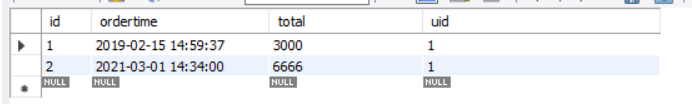

user表

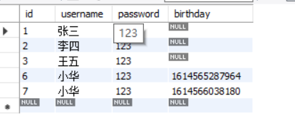

使用sql查询

select *, o.id oid from orders o,user u where o.uid=u.id

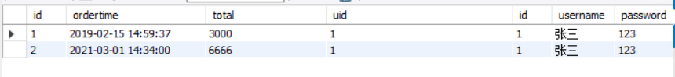

上面的sql将两个表进行了联合

实体类(省略了,get,set,toString方法)

order订单类

```java
private int id;
private Date ordertime;
private int total;
private User user;//当前订单属于哪一个用户，因为Java是面向对象，所以应该使用引用
```

在我们使用sql进行查询出的结果中只有uid一项，而我们的订单类中有User实体的引用，所以我们在映射文件中就必须改变

```xml
<mapper namespace="com.baoliang.mapper.OrderMapper">
    <resultMap id="orderMap" type="order">
<!--        手动指定字段与实体属性的映射关系
        colum:字段名称
        property：实体属性名称
-->
        <id column="oid" property="id"></id>
        <result column="ordertime" property="ordertime"></result>
        <result column="total" property="total"></result>
        <result column="uid" property="user.id"></result>
        <result column="username" property="user.username"></result>
        <result column="password" property="user.password"></result>
        <result column="birthday" property="user.birthday"></result>
    </resultMap>
    <select id="findAll" resultMap="orderMap">
        select *, o.id oid from orders o,user u where o.uid=u.id
    </select>
```

slect标签中有一个resultMap,就是结果的映射，定义一个resultMap,其内部封装有标签id ,这个标签是专门为主键设置的，id中的column为查询结果中的属性名称 也就是使用select *, o.id oid from orders o,user u where o.uid=u.id查询出的结果，其中的主键我们修改名称为了oid,property对应订单Order实体类中的属性

下面<result>标签是封装查询结果的其他的。注意封装User实体的引用时是怎么封装的。

测试类

```java
InputStream resourceAsStream = Resources.getResourceAsStream("sqlMapperConfig.xml");
SqlSessionFactory sqlSessionFactory = new SqlSessionFactoryBuilder().build(resourceAsStream);
SqlSession sqlSession = sqlSessionFactory.openSession();
OrderMapper mapper = sqlSession.getMapper(OrderMapper.class);
List<Order> orderlist = mapper.findAll();
System.out.println(orderlist);

sqlSession.commit();
sqlSession.close();
```


**第二种配法**

```xml
<mapper namespace="com.baoliang.mapper.OrderMapper">
    <resultMap id="orderMap" type="order">
<!--        手动指定字段与实体属性的映射关系
        colum:字段名称
        property：实体属性名称
-->
        <id column="oid" property="id"></id>
        <result column="ordertime" property="ordertime"></result>
        <result column="total" property="total"></result>
<!--        <result column="uid" property="user.id"></result>-->
<!--        <result column="username" property="user.username"></result>-->
<!--        <result column="password" property="user.password"></result>-->
<!--        <result column="birthday" property="user.birthday"></result>-->
        
<!--       property="user"指的是Order实体中的属性名称 javaType指的是封装的类型是user类型-->
        <association property="user" javaType="user">
            前面的column依旧是查询结果中的属性名
            <id column="uid" property="id"></id>
            <result column="username" property="username"></result>
            <result column="password" property="password"></result>
            <result column="birthday" property="birthday"></result>
</association>
    </resultMap>
    <select id="findAll" resultMap="orderMap">
        select *, o.id oid from orders o,user u where o.uid=u.id
    </select>
</mapper>
```

不使用user.的形式，使用association

## 2.一对多的查询

用户与订单是一对多的

查询语句

select *,o.id oid from user u,orders o where u.id=o.uid

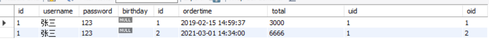

User实体类

```java
private int id;
private String username;
private String password;
//描述当前用户存在哪些订单
private List<Order>orderList;
```


映射文件

```xml
<mapper namespace="com.baoliang.mapper.UserMapper">

    <resultMap id="userMap" type="user">
        <id column="uid" property="id"></id>
        <result column="username" property="username"></result>
        <result column="password" property="password"></result>
        <result column="birthday" property="birthday"></result>

<!--        配置集合信息
        property=""集合名称
        ofType当前集合中的数据类型
-->
        <collection property="orderList" ofType="order">
<!--            封装order的数据-->
            <id column="oid" property="id"></id>
            <result column="ordertime" property="ordertime"></result>
            <result column="total" property="total"></result>
        </collection>
    </resultMap>
    <select id="findAll" resultMap="userMap">
        select *,o.id oid from user u,orders o where u.id=o.uid
    </select>
</mapper>
```

## 3.多对多查询

跟一对多主要的区别是在sql语句查询上

sql语句

```
SELECT * FROM user u ,sys_user_role ur,sys_role r where u.id=ur.userId and ur.roleId=r.id
```

下面是配置

```xml
<resultMap id="userRoleMap" type="user">
    <id column="userId" property="id"></id>
    <result column="username" property="username"></result>
    <result column="password" property="password"></result>
    <result column="birthday" property="birthday"></result>
    <collection property="roleList" ofType="role">
        <id column="roleId" property="id"></id>
        <result column="roleName" property="roleName"></result>
        <result column="roleDesc" property="roleDesc"></result>
    </collection>
</resultMap>
```

# 5.Mybatis的注解开发

## 1. Mybatis的常用注解

1. @Insert:实现新增
2. @Update：实现更新
3. @Delete:实现删除
4. @Select:实现查询
5. @Result:实现结果集封装
6. @Results：可以与@Result一起使用，封装多个结果集
7. @One:实现一对一结果集封装
8. @Many:实现一对多结果集封装

示例

可以把映射文件删掉，但是映射文件中sql语句还有用

当把映射文件删掉后，核心配置文件还是要加载映射关系，这个时候就要使用

```xml
<mappers>
   <package name="com.baoliang.mapper"/>mapper文件夹下的mapper文件中有映射关系
</mappers>
```

mapper文件夹中的文件

```java
public interface UserMapper {
    @Select("select * from user where id=#{id}")
    List<User> findAllById(int id);
}
```

测试

```java
private UserMapper mapper;
@Before
public void before() throws IOException {
    InputStream resourceAsStream = Resources.getResourceAsStream("sqlMapperConfig.xml");
    SqlSessionFactory sqlsessionfactory = new SqlSessionFactoryBuilder().build(resourceAsStream);
    mapper = sqlsessionfactory.openSession().getMapper(UserMapper.class);

}
@Test
public void test1(){
    System.out.println(mapper.findAllById(1));
}
```

## 2.Mybatis的注解实现复杂映射开发

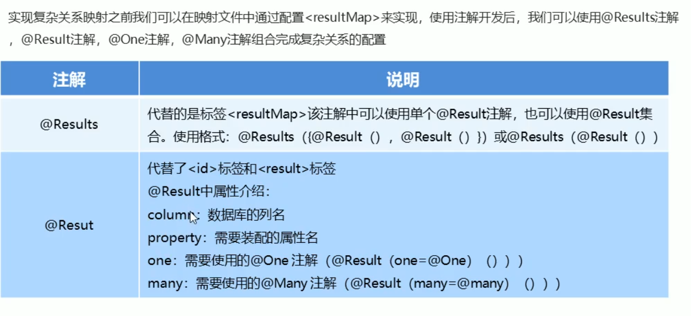

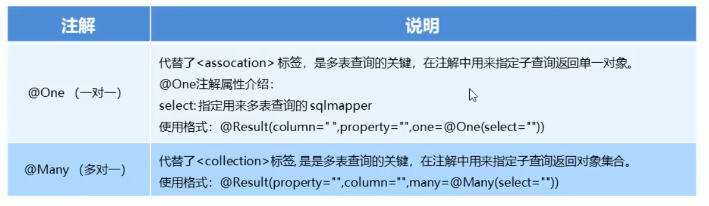

### 1.一对一注解开发

Mapper文件

```java
public interface OrderMapper {
    @Select("select * ,o.id oid from orders o,user u where o.uid=u.id")
    @Results({
            @Result(column = "oid",property = "id"),
            @Result(column = "ordertime",property = "ordertime"),
            @Result(column = "total",property = "total"),
            @Result(column = "uid",property = "user.id"),
            @Result(column = "username",property = "user.username"),
            @Result(column = "password",property = "user.password")

    })
    public List<Order> findAll();
}
```

其实就是跟xml中的ResultMap一样

在前边还学习了一种配置方法，<collection>配置User引用，在注解中也有

```java
@Select("select * from orders")
@Results({
        @Result(column = "id",property = "id"),
        @Result(column = "ordertime",property = "ordertime"),
        @Result(column = "total",property = "total"),
        @Result(
                property = "user",//要封装的属性名称，这个也是orders表中的
                column = "uid",//根据哪个字段去查询User表，这个字段在orders表中，根据orders的uid再查询user表
                javaType = User.class,//要封装的实体类型
                //select属性代表查询哪个实体所用的方法的全限定名称
                one = @One(select = "com.baoliang.mapper.UserMapper.findAllById")

        )
})
public List<Order> findAll();
```

上面这个相当于查询了两次，先查询出orders表的内容，再根据orders的uid查询user表

### 2.一对多注解开发

```java
@Select("select * from user where id=#{id}")
List<User> findAllById(int id);
@Select("select * from user")
@Results({
        @Result(id = true,column = "id",property = "id"),
        @Result(column = "username",property = "username"),
        @Result(column = "password",property = "password"),
        @Result(
                property = "orderList",
                column = "id",
                javaType = List.class,
                many = @Many(select = "com.baoliang.mapper.OrderMapper.findByUid")
        )
}

)
public List<User> findUserAndOrderAll();
```

### 3.多对多注解开发

下面这个是UserMapper

```java
@Select("select * from user")
@Results({
        @Result(id = true,column = "id",property = "id"),
        @Result(id = true,column = "username",property = "username"),
        @Result(id = true,column = "password",property = "password"),
        @Result(
                property = "roleList",
                column = "id",
                javaType = List.class,
                many = @Many(select = "com.baoliang.mapper.RoleMapper.findByUid")
        )
})
public List<User> findUserAndRoleAll();
```

```java
public interface RoleMapper {
    @Select("select * from sys_user_role ur,sys_role r where ur.roleId=r.id and ur.userId=#{uid}")
    public List<Role> findByUid(int uid);
}
```

上面这个是RoleMapper

# 6.SSM框架整合

