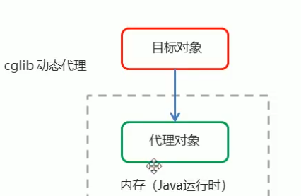

# 1.Spring 配置文件


## 1. 依赖注入的方法有

* set注入

* P命名空间注入

  可以不使用<prpoerty>标签进行注入

* 构造注入

  构造注入的时候如果有多个参数可以利用index

  ```xml
  <bean id="service" class="baoliang.service.imp.serviceimp">
      <constructor-arg index="0" ref="user"/>
      <constructor-arg index="1" value="666"/>
  </bean>
  ```


## 2. 注入的普通数据类型

在spring中中可以注入的三种数据类型：普通数据类型，引用数据类型，集合数据类型

 着重强调 list map  properties的注入，在ApplicationContext中进行注入的时候,下面就是例子

```xml
 <property name="strlist">
            <list>
                <value>朱</value>
                <value>宝</value>
                <value>亮</value>
            </list>
        </property>
        <property name="userMap">
            <map>
                <entry key="u1" value-ref="user1"></entry>
                <entry key="u2" value-ref="user2"></entry>
            </map>
        </property>
        <property name="properties">
            <props>
                <prop key="p1">ppp1</prop>
                <prop key="p2">ppp2</prop>
            </props>
        </property>
    </bean>
    <bean id="user1" class="com.baoliang.dao.User">
        <property name="name" value="张三"/>
        <property name="addr" value="北京"/>
    </bean>
    <bean id="user2" class="com.baoliang.dao.User">
        <property name="name" value="张三"/>
        <property name="addr" value="天津"/>
    </bean>
```

## 3.分模块开发

 ```xml
<import resource="app_test.xml"/>
 ```

## 4. Spring 相关的API

ApplicationContext是个接口

继承体系

    

# 2. Spring配置数据源

## 1. 数据源（连接池）的作用

DBCP，C3P0,BoneCp,Druid

C3P0的演示

```Java
ComboPooledDataSource dataSource=new ComboPooledDataSource();
dataSource.setDriverClass("com.mysql.cj.jdbc.Driver");
dataSource.setJdbcUrl("jdbc:mysql://localhost:3306?mydb&serverTimezone=UCT");
dataSource.setPassword("123");
dataSource.setUser("root");
Connection connection=dataSource.getConnection();
System.out.println(connection);
connection.close();
```

## 2.使用properties文件加载数据集

```java
//读取配置文件
ResourceBundle rb=ResourceBundle.getBundle("jdbc");
String driver =rb.getString("jdbc.driver");
String url =rb.getString("jdbc.url");
String password =rb.getString("jdbc.password");
String username =rb.getString("jdbc.username");
ComboPooledDataSource dataSource =new ComboPooledDataSource();
dataSource.setUser(username);
dataSource.setPassword(password);
dataSource.setJdbcUrl(url);
dataSource.setDriverClass(driver);
Connection connection=dataSource.getConnection();
System.out.println(connection);
connection.close();
```

## 3.在配置文件中加载属性文件

1. 首先修改开头的命名空间和网络的地址加入context命名空间

2. 使用

   ```xml
    <context:property-placeholder location="classpath:jdbc.properties"/>
   ```

   加载属性文件

3. 使用${}加载属性文件中的内容

   ```xml
   <context:property-placeholder location="classpath:jdbc.properties"/>
   <bean id="datasource" class="com.mchange.v2.c3p0.ComboPooledDataSource" >
       <property name="jdbcUrl" value="${jdbc.url}"/>
       <property name="driverClass" value="${jdbc.driver}"/>
       <property name="user" value="${jdbc.user}"/>
       <property name="password" value="${jdbc.password}"/>
   </bean>
   ```

   

# 3.Spring的注解开发

## 1.Spring 的原始注解


## 2.Spring 新注解


spring的新注解替换掉了xml文件

## Spring 配置类

```java
@Configuration
@ComponentScan(basePackages = {"baoliang"})
```

配置类例子

```java
@Configuration
@ComponentScan(basePackages = {"baoliang"})
@PropertySource(value = "classpath:jdbc.properties")
  public class Config {
    @Bean("userdao")
    public user userdao(){
        return new userimp();
    }

    @Bean("service")
    public service service(){
        serviceimp serimp=new serviceimp();
        return serimp;
    }

    @Value("${jdbc.driver}")
    String DriverClass;
    @Value("${jdbc.url}")
    String jdbcUrl;
    @Value("${jdbc.user}")
    String userName;
    @Value("${jdbc.password}")
    String password;
    @Bean("datasource")
    public DataSource getDataSource() throws Exception{
        ComboPooledDataSource comboPooledDataSource= new ComboPooledDataSource();
        comboPooledDataSource.setDriverClass(DriverClass);
        comboPooledDataSource.setJdbcUrl(jdbcUrl);
        comboPooledDataSource.setUser(userName);
        comboPooledDataSource.setPassword(password);

        return comboPooledDataSource;
    }
}
```

# 4.Spring集成Junit

1. 导入spring集成Junit坐标
2. 使用@Runwith注解替换原来的运行期
3. 使用@ContextConfiguration指定配置文件或配置类
4. 使用@Autowired注入需要测试的对象
5. 创建测试方法进行测试

@Runwith就是一个运行器，用于指定junit运行环境，是junit提供给其他框架测试环境接口扩展，为了便于spring的以来注入spring提供了**SpringJUnit4ClassRunner**作为Junit环境

这样就可以创建一个类用来进行测试，如下例子

```Java
@RunWith(SpringJUnit4ClassRunner.class)
@ContextConfiguration(classes = {Configration.class})
public class Test {

    @Autowired //根据类型进行注入
    private DataSource datasource;
    @org.junit.Test //设置测试的方法
    public void SourceTest()throws Exception{
        System.out.println(datasource.getConnection());
    }
}
```

# 5. Spring的Aop简介

Aop为Aspect Oriented Programming的缩写，意思为面向切面编程，是通过编译方式和运行期动态代理实现程序功能的同意维护的一种技术 

动态代理的优点：在不修改源码的情况下对目标方法进行增强，其作用可以完成程序之间的松耦合

**Spring两大核心：AOP，AOC**

AOP的优势：1.在程序运行期间，在不修改源码的情况下对目标方法进行增强

   					2. 优势：减少重复代码，提高开发效率，并且便于维护

AOP常用的动态代理技术

1. JDK代理：基于接口的动态代理技术，必须基于接口，没有接口无法代理

2. cglib代理：基于父类的动态代理技术

   

   




## 1. jdk动态代理

```Java
public static void main(String[] args){
    Target target=new Target();
    Advice advice=new Advice();
    //观察上面的第一幅图片就会发现，代理对象跟源对象是兄弟关系
    TargetInterface proxy= (TargetInterface) Proxy.newProxyInstance(
            target.getClass().getClassLoader(),
            target.getClass().getInterfaces(),
            new InvocationHandler() {
                @Override
                public Object invoke(Object proxy, Method method, Object[] args) throws Throwable {
                    advice.before();
                    Object re=method.invoke(target,args);
                    advice.after();
                    return re;
                }
            });

    proxy.save();
}
```

 

## 2. cglib动态代理

1. 创建增强器

2. 设置父类

3. 设置回调

4. 创建代理对象

   ```Java
   public static void main(String[] args){
       Target target=new Target();
       Advice advice=new Advice();
       Enhancer enhancer=new Enhancer();
       enhancer.setSuperclass(target.getClass());
       enhancer.setCallback(new MethodInterceptor() {
           @Override
           public Object intercept(Object o, Method method, Object[] objects, MethodProxy methodProxy) throws Throwable {
               advice.before();
               Object invoke=methodProxy.invokeSuper(target,args);
               advice.after();
               return invoke;
           }
       });
       //上面的第二幅图显示代理对象与原对象是父子关系
       Target proxy=(Target) enhancer.create();
       proxy.save();
   }
   ```

## 3. AOP概念

连接点：可以被增强的方法叫做连接点

切入点：真正被增强的方法叫做切入点，因为有些方法可以增强但不会增强

通知/增强：拦截到切点之后所要做的事情就是通知

切面：是切入点和通知的结合

织入： 它是个动词，就是切点跟通知结合的过程叫做的织入

## 4. 使用哪种代理方式

在spring中，框架会根据目标类是否实现了接口来决定采用哪种代理的方式


## 5. 基于XML的AOP开发

1. 导入AOP相关坐标
2. 创建目标接口和目标类（内部有切点）
3. 创建切面类（内部有增强的方法）
4. 将目标类和切面类的对象创建权交给spring
5. 在applicationContext.xml中配置织入关系
6. 测试代码

```xml
<bean id="target" class="com.baoliang.proxy.aop.Target"/>
<bean id="Aspect" class="com.baoliang.proxy.aop.MyAspect"/>
<aop:config>
    <aop:aspect ref="Aspect">
        <aop:before method="before" pointcut="execution(public void com.baoliang.proxy.aop.Target.save())"/>
    </aop:aspect>
</aop:config> 
```

execution表达式：

1. 访问修饰符可以省略
2. 返回值类型，包名，类名，方法名可以使用*代表任意
3. 包名与类名之间一个点.代表当前包下的类，两个点..代表当前包及其子包下的类
4. 参数列表可以使用两个点..表示任意个数，任意类型参数列表

## 6. xml配置：通知类型


注意一点：后置通知是after-returning而最终通知是after;


## 7.切点表达式的抽取

```xml
<aop:config>
        <aop:aspect ref="Aspect">
            <aop:pointcut id="mypoint" expression="execution(public void com.baoliang.proxy.aop.*.*(..))"/>
            <aop:before method="befores" pointcut-ref="mypoint"/>
        </aop:aspect>
    </aop:config>
```


## 8. 使用注解进行配置AOP

1. 导入AOP相关坐标

2. 创建目标接口和目标类（内部有切点）

3. 创建切面类（内部有增强的方法）

4. 在切面中使用注解配置织入关系

5. 在配置文件中开启组件扫描和AOP的自动代理

   下面是自动代理的设置

   ```xml
   <aop:aspectj-autoproxy/>
   ```

   

上面是注解的通知类型

## 9. 注解切点表达式的抽取

```java
@Component("myaspect")
@Aspect
public class Anno_Aspect {
    @Before("Anno_Aspect.pointcunt()")//也可以写pointcunt()
    public void before(){
        System.out.println("前置增强");
    }
    @Pointcut("execution(* com.baoliang.proxy.anno.Target.*(..) )")//抽取了切点表达式，因为注解必须依存一个东西所以写一个空的方法
    public void pointcunt(){}
}
```

 

# 6.Spring JdbcTemplate的使用

## 1. jdbcTemplate开发步骤

1. 导入spring-jdbc和spring-tx坐标 tx代表transection事务
2. 创建数据库表和实体
3. 创建jdbcTemplate对象
4. 执行数据库操作

## 2. 基本基本步骤示例

```java
ComboPooledDataSource dataSource=new ComboPooledDataSource();
dataSource.setDriverClass("com.mysql.cj.jdbc.Driver");
dataSource.setUser("root");
dataSource.setJdbcUrl("jdbc:mysql://localhost:3306/mydb?serverTimezone=UTC");
dataSource.setPassword("123");
//创建jdbcTemplate然后设置数据源
JdbcTemplate jdbcTemplate=new JdbcTemplate();
jdbcTemplate.setDataSource(dataSource);
int row=jdbcTemplate.update("insert into account values(?,?)","xiaoliang",99999);
System.out.println(row);
```


xml配置


## 3.jdbc实体封装

```java
@Autowired
private JdbcTemplate jdbcTemplate;
@Test
public void testQuery(){
    List<Account> accountList = jdbcTemplate.query("select * from account",new BeanPropertyRowMapper<Account>(Account.class));
    System.out.println(accountList);
}
```

在类配置文件中直接引用已经存在的bean不用使用AnnotationConfigApplicationContext

```java
@Configuration
@PropertySource("classpath:jdbc.properties")
public class config {
    @Value("${jdbc.driver}")
    private String driver;
    @Value("${jdbc.url}")
    private String jdbcURL;
    @Value("${jdbc.user}")
    private String user;
    @Value("${jdbc.password}")
    private String password;
    @Bean("datasource")
    public DataSource comboSource() throws  Exception{
        System.out.println(driver+"=="+jdbcURL+"=="+user+"=="+password);
        ComboPooledDataSource dataSource=new ComboPooledDataSource();
        dataSource.setDriverClass(driver);
        dataSource.setJdbcUrl(jdbcURL);
        dataSource.setUser(user);
        dataSource.setPassword(password);
        return dataSource;
    }
    @Bean("jdbcTemplate")
    public JdbcTemplate getJdbcTemplate() throws Exception {
        JdbcTemplate jdbcTemplate=new JdbcTemplate();
        jdbcTemplate.setDataSource(comboSource());
        return jdbcTemplate;
    }
```

## 4.实体封装后各种查询

使用`BeanPropertyRowMapper`将数据库查询结果转换为`Java`类对象。

```Java
@Autowired
private JdbcTemplate jdbcTemplate;
@Test

public void testQuery(){
    //查询全部
    List<Account> accountList = jdbcTemplate.query("select * from account",new BeanPropertyRowMapper<Account>(Account.class));
    System.out.println(accountList);
//查询单个
    Account accountq=jdbcTemplate.queryForObject("select * from account where name=?",new BeanPropertyRowMapper<Account>(Account.class),"sam");
    System.out.println(accountq);
//聚合查询 
    Long count=jdbcTemplate.queryForObject("select count(*) from account",Long.class);
    System.out.println(count);

}
```

## 5. jdbc总结


# 7.Spring事务控制

## 1.编程式事务控制

PlatformTransactionManager是Spring的事务管理器接口，它提供了我们常用的操作事务的方法，注意它只是规范了有哪些方法，具体的实现有很多种，这就要看Dao层的技术是什么，就用哪一种实现。

需要通过配置的方法告诉spring使用的什么技术。

## 2.编程式事务控制相关对象

**TransactionDefinition 是事务的定义信息对象，它封装了一些相关的参数，里面有如下的方法**

| 方法                         | 说明               |
| ---------------------------- | ------------------ |
| int getIsolationLevel()      | 获得事务的隔离级别 |
| int getPropogationBehavior() | 获得事务的传播行为 |
| int getTimeout()             | 获得超时时间       |
| boolean isReadOnly()         | 是否只读           |

### 1.事务的隔离级别

设置隔离级别，可以解决事务并发产生的问题，如**脏读，不可重复读，和虚读**（**幻读**）

**并发下事务会产生的问题**

1.脏读

所谓脏读，就是指**事务A读到了事务B还没有提交的数据**，比如银行取钱，事务A开启事务，此时切换到事务B，事务B开启事务-->取走100元，此时切换回事务A，事务A读取的肯定是数据库里面的原始数据，因为事务B取走了100块钱，并没有提交，数据库里面的账务余额肯定还是原始余额，这就是脏读

2.不可重复读

所谓不可重复读，就是指**在一个事务里面读取了两次某个数据，读出来的数据不一致**。还是以银行取钱为例，事务A开启事务-->查出银行卡余额为1000元，此时切换到事务B事务B开启事务-->事务B取走100元-->提交，数据库里面余额变为900元，此时切换回事务A，事务A再查一次查出账户余额为900元，这样对事务A而言，在同一个事务内两次读取账户余额数据不一致，这就是不可重复读。

3.虚读（幻读）

所谓幻读，就是指**在一个事务里面的操作中发现了未被操作的数据**。比如学生信息，事务A开启事务-->修改所有学生当天签到状况为false，此时切换到事务B，事务B开启事务-->事务B插入了一条学生数据，此时切换回事务A，事务A提交的时候发现了一条自己没有修改过的数据，这就是幻读，就好像发生了幻觉一样。**幻读出现的前提是并发的事务中有事务发生了插入、删除操作。**

地址：https://www.cnblogs.com/xrq730/p/5087378.html 

事务必须服从ACID原则：原子性（atomicity）,一致性（consistency），隔离性(isolation)，持久性(durability)

* 原子性：

即不可分割，事务要么全部被执行，要么全部不执行。如果事务的所有子事务全部提交成功，则所有的数据库操作被提交，数据库状态发生变化；如果有子事务失败，则其他子事务的数据库操作被回滚，即数据库回到事务执行前的状态，不会发生状态转换

* 一致性

  事务的执行使得数据库从一种正确状态转换成另外一种正确状态

* 隔离性

  在事务正确提交之前，不允许把事务对该数据的改变提供给任何其他事务，即在事务正确提交之前，它可能的结果不应该显示给其他事务

* 持久性

  事务正确提交之后，其结果将永远保存在数据库之中，即使在事务提交之后有了其他故障，事务的处理结果也会得到保存

一共有四种事务的隔离级别，能设置5种

1. ISOLATION_DEFAULT 数据库 默认的
2. ISOLATION_READ_UNCOMMITTED 哪一种都不能解决
3. ISOLATION_READ_COMMITTED 解决脏读
4. ISOLATION_REPEATABLE_READ 解决不可重复读
5. ISOLATION_SERIALIZABLE 全能解决，但性能较低

**事务的作用**

事务管理对于企业级应用而言至关重要，**它保证了用户的每一次操作都是可靠的**，即便出现了异常的访问情况，也不至于破坏后台数据的完整性。

### 2. 事务的传播行为

传播行为主要解决业务方法在调用业务方法的时**候事务同一性的问题**，事务当中有重复的行为

举例子：A业务方法调用B业务方法，A和B中可能存在相同的方法，这时候就出现事务的同一性问题。

 

1. REQUIRED ：如果当前没有事务，就新建一个事务，如果已经存在一个事务中，加入这个事务中。一般选择（默认值）---解释一下前面,举个例子A调用B，B看A当前没有事务，就新建一个事务，如果B看A有事务，就加入到这个事务中
2. SUPPORTS：支持当前事务，如果当前没有事务，就以非事务方式进行（没有事务）--解释一下，A调用B，如果B看A有事务则一块用这个事务运行，如果B看A没有事务，那么就以非事务方式运行
3. MANDATORY：使用当前的事务，如果当前没有事务，就抛出异常--解释一下A调用B，如果B看A有事务那么使用当前A的事务一块运行，如果B看A没有事务那么就抛出异常。
4. REQUERS_NEW:新建事务,如果当前在事务中,把当前事务挂起--解释一下B调用A,如果B事务在A事务当中,新建事务,把A中当前事务挂起
5. NOT_SUPPORTED:以非事务方式执行操作,如果当前存在事务,就把当前事务挂起--解释一下,A调用B,B看A如果A存在事务，就把当前事务挂起，B以非事务方式执行
6. NEVER:以非事务方式运行，如果当前存在事务，抛出异常--解释一下,B调用A如果B看A当前存在事务，就抛出异常，B以非事务方式运行
7. NESTED：如果当前存在事务,则在嵌套事务内执行,如果当前没有事务,则执行REQUIRED类似的操作
8. 超时时间:默认值是-1,没有时间限制,如果有,以秒为单位进行设置
9. 是否只读:建议查询时设置为只读

### 3.TransactionStatus

TransactionStatus接口提供的是事务具体的运行状态,方法介绍如下

| 方法                       | 说明           |
| -------------------------- | -------------- |
| boolean hasSavepoint()     | 是否存储回滚点 |
| boolean isCompleted()      | 事务是否完成   |
| boolean isNewTransaction() | 是否是新事务   |
| boolean isRollbackOnly()   | 事务是否回滚   |

### 4.小结


上面第一个,第二个需要进行配置

## 3.基于XML声明式事务控制

**什么是声明式事务控制?**

Spring 的声明式事务顾名思义就是采用声明的方式来处理事务,这里所说的声明,就是指在配置文件中声明,用在Spring配置文件中声明式的处理事务来代替代码的处理事务

**声明式事务处理的作用**

1. 事务管理不侵入开发的组件(解耦),具体来说,业务逻辑对象就不会意识到正在事务管理之中,事实上也应该如此,因为事务管理是属于系统层面的服务,而不是业务逻辑的一部分,如果想要改变事务管理策划的话,也只需要在定义文件中重新配置即可:上面这个就是AOP思想,在业务执行的时候进行了事务控制,切点就是业务,通知就是事务的控制

2.  在不需要事务管理的时候,只要在设定文件上修改一下,即可移除事务管理服务,无需改变代码重新编译

   注意:Spring声明式事务控制底层就是AOP

### 1. 声明式事务控制实现

明确的事项：

1. 谁是切点
2. 谁是通知
3. 配置切面

```xml
<?xml version="1.0" encoding="UTF-8"?>
<beans xmlns="http://www.springframework.org/schema/beans"
       xmlns:xsi="http://www.w3.org/2001/XMLSchema-instance"
       xmlns:context="http://www.springframework.org/schema/context"
       xmlns:tx="http://www.springframework.org/schema/tx" xmlns:aop="http://www.springframework.org/schema/aop"
       xsi:schemaLocation="http://www.springframework.org/schema/beans http://www.springframework.org/schema/beans/spring-beans.xsd
                           http://www.springframework.org/schema/context http://www.springframework.org/schema/context/spring-context.xsd
                           http://www.springframework.org/schema/tx http://www.springframework.org/schema/tx/spring-tx.xsd http://www.springframework.org/schema/aop https://www.springframework.org/schema/aop/spring-aop.xsd">

    <context:property-placeholder location="classpath:jdbc.properties"/>
    <bean id="datasource" class="com.mchange.v2.c3p0.ComboPooledDataSource">
        <property name="driverClass" value="${jdbc.driver}"/>
        <property name="jdbcUrl" value="${jdbc.url}"/>
        <property name="user" value="${jdbc.user}"/>
        <property name="password" value="${jdbc.password}"/>
    </bean>
    <bean id="jdbcTemplate" class="org.springframework.jdbc.core.JdbcTemplate">
        <property name="dataSource" ref="datasource"/>
    </bean>
    <bean id="Account" class="com.baoliang.dao.imp.AccountDaoImp">
        <property name="jdbcTemplate" ref="jdbcTemplate"/>
    </bean>
<!--    目标对象，内部方法就是切点-->
    <bean id="AccountService" class="com.baoliang.service.imp.AccountServiceImpl">
        <property name="accountDao" ref="Account"/>
    </bean>
<!--    配置平台事务管理器-->
    <bean id="transactionmanager" class="org.springframework.jdbc.datasource.DataSourceTransactionManager">
        <property name="dataSource" ref="datasource"/>为什么配置datasource是因为平台事务管理器要获取DataSource来进行事务的控制
    </bean>
<!--    通知，事务增强-->
    <tx:advice id="txAdvice" transaction-manager="transactionmanager">平台事务管理器是加在通知，事务增强上的。
        设置事务的属性信息
        <tx:attributes>transaction
            <tx:method name="transfer" isolation="DEFAULT" propagation="REQUIRED" timeout="-1" read-only="false"/>可以对某个方法单独的进行事务的配置
            <tx:method name="*" isolation="DEFAULT" propagation="REQUIRED" timeout="-1" read-only="false"/>表示哪个方法被增强，*代表所有的方法
        </tx:attributes>
    </tx:advice>

<!--    事务织入-->
    <aop:config>普通的是<aop:advice></aop:advice>标签
        <aop:advisor advice-ref="txAdvice" pointcut="execution(* com.baoliang.service.imp.*.*(..))"></aop:advisor>
    </aop:config>
</beans>
```


其中<tx:method>代表切点方法的事务参数的配置，例如：

```xml
<tx:method name="transfer" isolation="DEFAULT" propagation="REQUIRED" timeout="-1" read-only="false"/>
```

name:切点方法名称

isolation:事务的隔离级别

propogation:事务的传播行为

timeout:超时时间

read-only:是否只读


配置织入可以将切点进行提取

## 4.基于注解的声明式事务控制

在事务上加注解控制

```java
@Service("service")
public class AccountServiceImpl implements AccountService {
    @Autowired
    private AccountDao accountDao;
    @Transactional(isolation = Isolation.READ_COMMITTED,propagation = Propagation.REQUIRED)
    @Override
    public void transfer(String outMan, String inMan, double money) {
        accountDao.out(outMan,money);
        int a=1/0;
        accountDao.in(inMan,money);
    }
}
```

   @Transactional(isolation = Isolation.READ_COMMITTED,propagation = Propagation.REQUIRED)这一行也可以加在类上面，这样整个类的方法事务控制属性都是这个，如果类和方法上同时有，则根据就近原则选择方法上面。

最重要的一点要开启注解事务的驱动以及包的扫描

```xml
<tx:annotation-driven transaction-manager="transactionmanager"/>
<context:component-scan base-package="com.baoliang"/>
```

# 8. Spring 集成web环境

## 1.基本环境搭建

web.xml进行文件配置

```xml
<?xml version="1.0" encoding="UTF-8"?>
<web-app xmlns="http://xmlns.jcp.org/xml/ns/javaee"
         xmlns:xsi="http://www.w3.org/2001/XMLSchema-instance"
         xsi:schemaLocation="http://xmlns.jcp.org/xml/ns/javaee http://xmlns.jcp.org/xml/ns/javaee/web-app_4_0.xsd"
         version="4.0">
    <servlet>
        <servlet-name>userServerlet</servlet-name>
        <servlet-class>com.baoliang.web.userServerlet</servlet-class>
    </servlet>
    <servlet-mapping>
        <servlet-name>userServerlet</servlet-name>
        <url-pattern>/userServletss</url-pattern>
    </servlet-mapping>
</web-app>
```

serverlet配置

```java
public class userServerlet extends HttpServlet {

    @Override
    protected void doGet(HttpServletRequest req, HttpServletResponse resp) throws ServletException, IOException {
//        super.doGet(req, resp);
        ApplicationContext app=new ClassPathXmlApplicationContext("applicationContext.xml");
        UserService userService=app.getBean(UserService.class);
        userService.serviceFunc();
    }
}
```

## 2. ContextLoaderListener

ApplicationContext引用上下文获取方式

引用上下文对象是通过new ClasspathXmlAppliationContext(spring配置文件)方式获取的，但是每次从容器中获得Bean都要编写new ClaspathXmlApplicationContext配置文件，这样的弊端是配置文件加载多次，应用上下文创建多次。

在Web项目中，可以使用ServletContextListener监听Web应用的启动，我们可以在Web应用启动时，就加载Spring配置文件，创建，应用上下文对象ApplicationContext,在将其存储到最大的域servletContext域中，这样就可以在任意位置从域中获得应用上下文Application对象了。

步骤：

step1:创建监听器,必须实现ServletContextListener两个方法

```java
public class listener implements ServletContextListener {
    @Override
    public void contextInitialized(ServletContextEvent servletContextEvent) {
        ApplicationContext app=new ClassPathXmlApplicationContext("applicationContext.xml");
        ServletContext servletContext=servletContextEvent.getServletContext();
        servletContext.setAttribute("app",app);
        System.out.println("Spring容器创建完毕");
    }

    @Override
    public void contextDestroyed(ServletContextEvent servletContextEvent) {

    }
}
```

step2:在web.xml中配置监听器，这样就不用一次次的创建ApplicationContext了。我们创建了监听器但是Spring并不知道，所以要进行配置

```xml
<listener>
    <listener-class>com.baoliang.listener.listener</listener-class>
</listener>
```

使用方法

```java
ServletContext servletContext=this.getServletContext();获取上下文
ApplicationContext app= (ApplicationContext) servletContext.getAttribute("app");获取上面存储的app
UserService userService=app.getBean(UserService.class);
userService.serviceFunc();
```

## 3.进一步优化，使用初始化参数

配置文件的名字可以是任何名称，如果写在程序中就会耦合死，那么需要解耦合，设置初始化参数

web.xml配置

```xml
<context-param>
    <param-name>contextConfiguration</param-name>
    <param-value>applicationContext.xml</param-value>
</context-param>
```

使用

```java
ServletContext servletContext=servletContextEvent.getServletContext();
String contextConfigLoation=servletContext.getInitParameter("contextConfiguration");
ApplicationContext app=new ClassPathXmlApplicationContext(contextConfigLoation);
```

## 4.使用工具类

因为我们设置了属性，就会产生一个问题，会产生大量的String 类型的(类似"app")的上下文属性名称，这个时候很容易混淆，就需要创建一个工具类获得这些属性

```java
public class WebApplicationContextUtils {

    public static ApplicationContext getApplicationContext(ServletContext servletContext){
        return (ApplicationContext) servletContext.getAttribute("app");
   
   }
}
```

使用

```java
ServletContext servletContext=this.getServletContext();
        ApplicationContext app= WebApplicationContextUtils.getApplicationContext(servletContext);
        UserService userService=app.getBean(UserService.class);
        userService.serviceFunc();
```

## 5.Spring提供的工具类

上面的实现是模拟spring工具类，现在写的是spring封装的工具类

上面的分析不用手动实现，spring提供了一个监听器ContextLoaderListener就是对上述功能的封装，**该监听器内部加载spring配置文件，创建应用上下文，并存储到ServletContext域中**，提供了一个客户端工具WebAppliationContextUtils供使用者获得应用上下文对象。

步骤

1. 在web.xml中配置ContextLoaderListener(导入spring-web坐标)
2. 使用WebApplicationContextUtils获得应用上下文对象ApplicationContext

在web.xml中配置applicationContext.xml路径的时候context-param中的name一定要写

```xml
contextConfigLocation
```

否则找不到文件

```xml
<context-param>
    <param-name>contextConfigLocation</param-name>这个一定要固定
    <param-value>classpath:applicationContext.xml</param-value>
</context-param>

<listener>
    <listener-class>org.springframework.web.context.ContextLoaderListener</listener-class>
</listener>
```

# 9.SpringMVC

## 1.Springmvc概述

SpringMVC是一种基于Java实现MVC设计模型的请求驱动类型的轻量级Web框架，属于SpringFrameWork的后续产品，已经融合在SpringWebFlow中

它通过一套注解，让一个简单的Java类成为处理请求的控制器，而无需实现任何接口。同时它还支持RESTful编程风格的请求 


Tomcat服务器接收客户端的请求，封装代表请求的req,代表响应的resp，然后去Web应用中调用相应的资源，其中在Servelet中有一部分是共有的行为，有一部分是特有的行为，共有行为使用前端控制器SpringMVC来完成，特有的行为自己编写（普通javabean自己写）。

## 2.springmvc开发步骤

1. 导入springMVC的包，导入坐标

2. 配置Servlet,一般配置/表示所有请求都过这个处理（共有行为），也就是配置SpringMVC核心控制器DispathcerServlet，这个玩意就是前端控制器
3. 编写POJO(Controller)，也就是创建Controller和视图页面
4. 把POJO（Conroller）使用注解配置放到容器当中 （@Component或者@Controller）,也就是使用注解配置Controller类中业务方法的映射地址
5. 开启组件扫描，在spring_mvc.xml中配置组件扫描

导入spring-webmvc才有DispathcerServlet前端控制器


示例演示

1. 

```xml
<dependency>
    <groupId>org.springframework</groupId>
    <artifactId>spring-webmvc</artifactId>
    <version>5.2.12.RELEASE</version>
</dependency>
```

2. ```xml
   <!--    配置前端控制器-->
       <servlet>
           <servlet-name>DispathcerServlet</servlet-name>
           <servlet-class>org.springframework.web.servlet.DispatcherServlet</servlet-class>
           <init-param>
               <param-name>contextConfigLocation</param-name>
               <param-value>classpath:spring_mvc.xml</param-value>
           </init-param>
           <load-on-startup>1</load-on-startup>加载的优先级，数字越小优先级越高。
       </servlet>
       <servlet-mapping>
           <servlet-name>DispathcerServlet</servlet-name>
           <url-pattern>/</url-pattern>
       </servlet-mapping>
   ```

3. 

```java
@Controller
public class UserController {
    @RequestMapping("/quick")
    public String save(){
        System.out.println("Controller save running");
        return "success.jsp";
    }
}
```

同时还要创建success.jsp

5. 

```xml
<?xml version="1.0" encoding="UTF-8"?>
<beans xmlns="http://www.springframework.org/schema/beans"
       xmlns:xsi="http://www.w3.org/2001/XMLSchema-instance"
       xmlns:context="http://www.springframework.org/schema/context"
       xsi:schemaLocation="http://www.springframework.org/schema/beans http://www.springframework.org/schema/beans/spring-beans.xsd
                            http://www.springframework.org/schema/context  http://www.springframework.org/schema/context/spring-context.xsd
">
<context:component-scan base-package="com.baoliang.controller"/>
</beans>
```

## 3.SpringMVC组件解析

DispathcerServlet**前端控制器只负责调度**，


1. 首先客户端进行请求
2. 前端控制器查询Handler，帮你取请求HandlerMapping组件,由处理器映射器HandlerMapping处理，它负责帮你解析，知道最终要找谁
3. HandlerMapping返回处理器执行链HandlerExecutionChain，为什么是链而不是一个，是因为在调用资源前要通过一系列的拦截器进行处理,返回给前端控制器
4. 前端控制器执行Handler，帮你取请求处理器适配器HandlerAdaptor
5. 由HandlerAdaptor请求自己写的那个controller也就是处理器Handler
6. controller响应
7. 处理器适配器HandlerAdaptor返回ModelAndView给前端控制器
8. 前端控制器再取请求视图解析器ViewResolver
9. 视图解析器返回view对象
10. 由前端控制器进行解析渲染视图页面 
11. 最终返回给客户端

## 4. SpringMVC注解解析

**@RequestMapping:**请求映射，用于建立请求URL和处理请求方法之间的对应关系

位置：

* 类上，请求URL的第一级访问目录。此处不写的话，就相当于应用的根目录

* 方法上，请求URL的第二级访问目录，与类上的使用@RequestMapping标注的一级目录一起组成虚拟路径

  此处要注意，返回值例如"success.jsp"这样写就会找不到资源，所以我们要使用相对路径返回"/success.jsp"

  此处请求的应该是http:localhost:8080/xxxProject/user/quick

```java
@RequestMapping("/user")
public class UserController {
    @RequestMapping("/quick")
    public String save(){
        System.out.println("Controller save running");
        return "/success.jsp";
    }
}
```

@RequestMapping的参数

1. value:用于指定请求的URL。它和path 属性的作用是一致的
2. method:用于指定请求的方式 get,post,枚举方式 RequestMethod.GET........
3. params:用于指定限制请求参数的条件。它支持简单的表达式。要求请求参数的key和value必须和配置的一模一样

举例：params={"accountName"},表示请求参数必须有accountName

params={"money!100"}，表示请求参数中money不能是100

## 5.SpringMVC组件扫描

```xml
<context:component-scan base-package="com.baoliang">
    <context:include-filter type="annotation" expression="org.springframework.stereotype.Controller"/>
</context:component-scan>
```

上面的这个是只扫Controller注解下的

```xml
<context:exclude-filter type="" expression=""/>
```

这个的意思是排除这个下面的其他全部扫。

## 6.SpringMVC的XML配置解析

forward:是转发，当我们输入地址页面变化后地址没有变化，并没有变成资源地址

redirect:是重定向，当我们输入地址页面变化后出现的是资源的地址。

在springMVC包下有一个DispatcherServlet.properties文件，文件中有前端控制器的一些默认的配置，包括HandlerMapping，HandlerAdapter，ViewResolver等，其中ViewResolver是视图解析器，这个解析器为InternalResourceViewResolver，它的父类UrlBasedViewResolver中包括之前说的forward和redirect以及URL前后缀

prefix为前缀

suffix为后缀

设置URL的前后缀

```xml
<bean id="ViewResolver" class="org.springframework.web.servlet.view.InternalResourceViewResolver">
    <property name="prefix" value="/jsp/"/>
    <property name="suffix" value=".jsp"/>
</bean>
```

这样我们在Controller中只返回success就会拼接成/jsp/success.jsp

## 7.springMVC知识要点

SpringMVC的相关组件

1. 前端控制器:DispatcherServlet

2. 处理器映射器:HandlerMapping

3. 处理器适配器:HandlerAdapter

4. 处理器:Handler

5. 视图解析器:ViewResolver

6. 视图View

   SpringMVC的注解和配置

   1. 请求映射注解：@RequestMapping

   2. 视图解析器配置

      REDIRECT_URL_PREFIX="redirect:"

      FORWARD_URL_PREFIX="forward"

      prefix="";

      suffix="";

## 8. .SpringMVC的数据响应

SpringMVC的数据响应方式

1. 页面跳转

   直接返回字符串

   通过ModelAndView对象返回

2. 回写数据

   直接返回字符串

   返回对象或集合 

### 1. 页面跳转-直接返回字符串形式

直接返回字符串：此种方式会将返回的字符串与视图解析器的前后缀拼接后跳转

前面演示过此种方式：forward和redirect以及字符串的拼接

### 2. 页面跳转-返回ModelAndView

```java
@RequestMapping("/quick2")
public ModelAndView save2(){
    ModelAndView modelAndView=new ModelAndView();
    System.out.println("Controller save running");
    modelAndView.addObject("username","itcast");//这里设置后，可以在页面中通过${username的方式取出来}
    modelAndView.setViewName("success");
    return modelAndView;
}
```

```html
<body>
success!${username}
</body>
```

自动注入ModelAndView

```java
@RequestMapping("/quick3")
public ModelAndView save3(ModelAndView modelAndView){
    modelAndView.addObject("username","itcast");
    modelAndView.setViewName("success");
    return modelAndView;
}
```

上面这个没有new ModelAndView而是 SpringMVC自动注入的

分离式的Model和view

下面的这个其实是将modelAndView进行了拆解

```java
@RequestMapping("/quick4")
public String save4(Model model){//这里也是自动注入的
    model.addAttribute("username","博学谷");//这里使用的是addAttribute而上面使用是addObject
    return "success";//注意看这个是返回的字符串model
}
```

其实上面这些都差不多只是形式不同而已


下面这个使用原生的HttpServletRequest

```java
@RequestMapping("/quick5")
public String save5(HttpServletRequest request){
    request.setAttribute("username","博学谷");
    return "success";
}
```

### 3.回写数据

1. 直接返回字符串

```java
@RequestMapping("/quick6")
public void save6(HttpServletResponse response) throws Exception{
    response.getWriter().println("success!!");
}
```

2. 直接返回字符串

   如果直接返回字符串就是寻找资源，但是我们要回写数据到页面上，所以要告诉框架，这个返回的字符串不是页面而是回写的数据，用到注解@ResponseBody

   

```java
@RequestMapping("quick7")
@ResponseBody
public String save7(){
    return "hello func7";
}
```

3. 返回json格式字符串

   必须导入包

   ```xml
   <dependency>
       <groupId>com.fasterxml.jackson.core</groupId>
       <artifactId>jackson-core</artifactId>
       <version>2.9.8</version>
   </dependency>
   <dependency>
       <groupId>com.fasterxml.jackson.core</groupId>
       <artifactId>jackson-databind</artifactId>
       <version>2.9.8</version>
   </dependency>
   <dependency>
       <groupId>com.fasterxml.jackson.core</groupId>
       <artifactId>jackson-annotations</artifactId>
       <version>2.9.8</version>
   </dependency>
   ```

   

   ```java
   @RequestMapping("quick8")
   @ResponseBody
   public String save8() throws Exception{
       user us=new user();
       us.setUsername("lisi");
       us.setAge(18);
       ObjectMapper objectMapper=new ObjectMapper();
       String json=objectMapper.writeValueAsString(us);
       return json;
   }
   ```

### 4. 返回对象或者集合

首先要配置处理器适配器

```xml
<bean class="org.springframework.web.servlet.mvc.method.annotation.RequestMappingHandlerAdapter">
    <property name="messageConverters">
        <bean class="org.springframework.http.converter.json.MappingJackson2HttpMessageConverter"/>
    </property>
</bean>
```

```java
@RequestMapping("quick9")
@ResponseBody
public user save9() throws Exception{
    user us=new user();
    us.setUsername("lisi");
    us.setAge(18);
    return us;
}
```

上面xml配置太麻烦，可以使用mvc注解驱动，这样就不用上面那样去配置了

```xml
<mvc:annotation-driven/>
```

但前提是引入mvc命名空间

### 5. SpringMVC获得请求参数

客户端请求参数的格式是：name=value&name=value...

服务器端要获得请求的参数，有时还需要进行数据的封装，springMVC可以接收如下类型的参数：

1. 基本类型参数
2. POJO类型参数（简单Javabean）
3. 数组类型参数
4. 集合类型参数

### 6.SpringMVC获得基本类型参数

Controller中的业务方法的参数名称要与请求参数的name一致，参数值会自动映射匹配

@ResponseBody不进行页面跳转

 在controller中示例

```java
@RequestMapping("quick6")
@ResponseBody
public void quick6(String name,int age) {
    System.out.println(name);
    System.out.println(age);
}
```

### 7.获得POJO类型

Controller中的业务方法的POJO参数的属性名与请求参数的name一致，参数值会自动映射匹配

在controller中的使用示例

```Java
@RequestMapping("quick7")
@ResponseBody
public void quick7(user us) {
    System.out.println(us);
}
```

封装POJO类型请求地址中name必须与user实体类中的属性一致才可以进行封装

### 8.SpringMVC获得数组类型参数

Controller中的业务方法数组名称与请求参数的name一致，参数会自动映射匹配

示例

```java
@RequestMapping("quick8")
@ResponseBody
public void quick8(String[] strs) {
    System.out.println(Arrays.asList(strs));
}
```

请求地址

http://localhost:8080/Review6_war_exploded/quick8?strs=a&strs=b

注意请求地址中的名称是一致的，同时可以使用多个数组，只要数组名称与请求中的参数名称一致就行

### 9.获得集合类型参数

获得结合参数时，要将集合参数包装到一个POJO中才可以

首先我们要将集合封装到一个实体当中，将这个实体当作参数，利用form表单进行提交

user实体

```Java
package com.baoliang.user;

public class user {
    private String name;
    private String add;

    public String getName() {
        return name;
    }

    public void setName(String name) {
        this.name = name;
    }

    public String getAdd() {
        return add;
    }

    public void setAdd(String add) {
        this.add = add;
    }

    @Override
    public String toString() {
        return "user{" +
                "name='" + name + '\'' +
                ", add='" + add + '\'' +
                '}';
    }
}
```

封装userlist的实体类VO

```java
package com.baoliang.user;

import java.util.List;

public class VO {
    private List<user> userlist;

    public void setUserlist(List<user> userlist) {
        this.userlist = userlist;
    }

    @Override
    public String toString() {
        return "VO{" +
                "userlist=" + userlist +
                '}';
    }

    public List<user> getUserlist() {
        return userlist;
    }
}
```

使用post提交的表单

```html
<%--
  Created by IntelliJ IDEA.
  User: Iamzh
  Date: 2021/2/25
  Time: 10:22
  To change this template use File | Settings | File Templates.
--%>
<%@ page contentType="text/html;charset=UTF-8" language="java" %>
<html>
<head>
    <title>Title</title>
</head>
<body>
<form action="${pageContext.request.contextPath}/quick9" method="post">
    <input type="text" name="userlist[0].name"><br>
    <input type="text" name="userlist[0].add"><br>
    <input type="text" name="userlist[1].name"><br>
    <input type="text" name="userlist[1].add"><br>
    <input type="submit" value="提交">
</form>
</body>
</html>
```

controller中的操作

```java
@RequestMapping("quick9")
@ResponseBody
public void quick9(VO vo) {
    System.out.println(vo);
}
```

 

### 10. 另外一种获取集合类型参数

使用ajax转化为json，

jsp页面

```html
<%@ page contentType="text/html;charset=UTF-8" language="java" %>
<html>
<head>
    <title>Title</title>
    <script src="${pageContext.request.contextPath}/js/jquery-3.5.1.js"></script>
    <script>
        var userlist =new Array();
        userlist.push({name:"zhansan",add:"山东"});
        userlist.push({name:"lisi",add:"山东"});
        $.ajax(
            {
                type:"POST",
                url:"${pageContext.request.contextPath}/quick10",
                data:JSON.stringify(userlist),
                contentType:"application/json;charset=utf-8"
            }
        );
    </script>
</head>
<body>

</body>
</html>
```

controller

```java
@RequestMapping("quick10")
@ResponseBody
public void quick10(@RequestBody List<user> userlist) {
    System.out.println(userlist);
}
```

其中的ResponseBody代表我们的请求体，客户端发送的是json格式数据，而contentType指定的是json

注意一点要在xml文件中写上资源，因为权限问题，如果不写就会封装失败

```xml
<mvc:resources mapping="/js/**" location="/js/"/>
```

解释一下上面

**静态资源访问权限的开启**

上面这个其中mapping代表我们的匹配地址，而后面的location是要找的资源地址。

为什么不写这个就会访问不到juery文件呢，因为我们在上面的Html页面中写有Jquery地址，但是当我们进行访问页面后，这个地址就会请求服务器，我们的Springmvc中并没有这个地址的匹配，那么就会什么都不干，写了上面这个当找不到匹配的时候，就会匹配这个地址资源

还有一种方式开放这个权限，不是让springmvc去匹配这个资源而是让tomcat进行匹配，当找不到的时候使用tomcat进行匹配。在xml中进行如下配置

```xml
<mvc:default-servlet-handler/>
```

### 11.解决请求参数的乱码问题

在web.xml中配置filter

```xml
<filter>
    <filter-name>CharacterEncodingFilter</filter-name>
    <filter-class>org.springframework.web.filter.CharacterEncodingFilter</filter-class>
    <init-param>
        <param-name>encoding</param-name>
        <param-value>UTF-8</param-value>
    </init-param>
</filter>
<filter-mapping>
    <filter-name>CharacterEncodingFilter</filter-name>
    <url-pattern>/*</url-pattern>
</filter-mapping>
```

### 12. 参数绑定注解

当请求的参数名称与Controller的业务方法参数名称不一致时，就需要通过@RequestParam注解显式绑定

就是我们使用的请求地址中参数名称与我们方法参数中名称不一致的时候如何获取参数。

就是在请求地址的参数名称和方法中的名称建立一个映射（**自己实验了一下，建立映射后原来的参数名称不能用了**）

 @requestParam注解的参数

* value :与请求参数名称
* required:此时指定的请求参数是否必须包括，默认是true,提交时如果没有此参数则报错
* defaultValue:当没有指定请求参数时，则使用指定的默认值赋值

### 13.获得Restful风格参数

Restful是一种架构风格，设计风格，而不是标准，也就是不用必须这么干，只是提供了一组设计原则和约束条件。主要用于客户端和服务器交互类的软件，基于这个风格设计的软件可以更简洁，更有层次，更易于实现缓存机制等。 

Restful风格的请求是使用“url+请求方式”表示一次请求目的的，HTTP协议里面四个表示操作方式的动词如下：

* GET：用于获取资源

* POST：用于新建资源

* PUT：用于更新资源

* DELETE:用于删除资源

  从上面我们知道**请求方式有四种**，只不过我们平常只使用前面两种

  下面列举的是请求地址的示例


**可以在RequestMapping中method中指定请求方式**

上述url地址/user/1中的1就是要获得的请求参数，在springMVC中可以使用占位符进行参数绑定。地址/user/1可以写成/user/{id},占位符对应的就是1的值。在业务方法中我们可以使用@PathVariable注解进行占位符的匹配获取工作

 

这样就可以不用键值对的方式直接解析地址内部的参数

示例地址 http://localhost:8080/Review6_war_exploded/quick12/zhansan

### 14.自定义类型转换器

 SpringMVC默认已经提供了一些常用的类型转换器，例如客户端提交的字符串转换成int型进行参数设置。

但不是所有的数据类型都提供了转换器，没有提供的就需要自定义转换器，例如：日期类型就需要自定义转换器

自定义类型转换器的开发步骤：

1. 定义转换器类实现Converter接口

2. 在配置文件中声明转换器

3. 在<annotation-driven>中引用转换器

   

1. 在类中自定义转换器

   ```java
   import org.springframework.core.convert.converter.Converter;
   
   import java.text.ParseException;
   import java.text.SimpleDateFormat;
   import java.util.Date;
   
   public class convertor implements Converter<String,Date> {
       @Override
       public Date convert(String source) {
           SimpleDateFormat format=new SimpleDateFormat("yyyy-MM-dd");
           Date date=null;
           try {
             date=format.parse(source);
           } catch (ParseException e) {
               e.printStackTrace();
           }
           return date;
       }
   }
   ```

2. 在配置文件声明转换器

```xml
创建转换器工厂
<bean id="ConversionServiceFactoryBean" class="org.springframework.context.support.ConversionServiceFactoryBean">
    <property name="converters">
        <list>
            <bean class="com.baoliang.service.convertor"/>
        </list>
    </property>
</bean>
在驱动中引用
<mvc:annotation-driven conversion-service="ConversionServiceFactoryBean"></mvc:annotation-driven>
```

3. 在驱动中引用如上

**补充一下** **/ 和/* 的区别**：

1、< url-pattern>/</url-pattern>  会匹配到/register这样的路径型url，不会匹配到模式为*.jsp这样的后缀型url，但是会拦截像.html .css的静态资源。

2、< url-pattern>/*</url-pattern> 会匹配所有url：路径型的和后缀型的url(包括/login,*.jsp,*.js和*.html等)

3、/* 可以匹配到所有的请求，它一般用在拦截器上。

4、很多人理解’/’不会拦截带扩展名的静态资源，这种理解是错误的！它其实也能拦截“.js”，“.css”，".png"等静态资源的访问。

### 15.获得请求头

@RequestHeader

使用@RequestHeader可得到请求头的信息，相当于web阶段学习的request.getHeader(name) @RequestHeader注解的属性如下：

* value:请求头的名称

* required:是否必须携带此请求头

  示例

  ```java
  @RequestMapping("/quick14")
  @ResponseBody
  public void quick14(@RequestHeader(value = "User-Agent",required = false) String param){
      System.out.println(param);
  }
  ```

我们从哪里看请求头？User-Agent代表什么？它们是浏览器的信息，其实，请求头有很多参数我们只是取得了User-Agent一个而已


在浏览器开发者工具中可以查看

@CookieValue

使用这个注解可以获得指定Cookie值，注解的属性如下

* value:指定cookie的名称
* required：是否必须携带此cookie

其实@RequestHeader也能获取cookie,只不过将键值对一块获得了

```Java
@RequestMapping("/quick15")
@ResponseBody
public void quick15(@CookieValue(value = "JSESSIONID",required = false) String param){
    System.out.println(param);
}
```

其中JSESSIONID是cookie键值对中的键

### 16. 文件上传

文件上传客户端三要素

1. 表单项type="file"

2. 表单提交方式是post

3. 表单的enctype属性是多部份表单形式，及enctype="multipart/form-data"

   


文件上传原理


在表单中我们可以看到，文件中的内容

单文件上传步骤

1. 导入fileupload和io坐标

   

2. 配置文件上传解析器

    

   ```xml
   <bean id="multipartResolver"  class="org.springframework.web.multipart.commons.CommonsMultipartResolver">
       <property name="defaultEncoding" value="UTF-8"/>
       <property name="maxUploadSize" value="999999999999"/>
   </bean>
   ```

   其中id multipartResolver必须固定，否则传不上去

3. 编写文件上传代码

   ```html
   <form action="${pageContext.request.contextPath}/quick16" method="post" enctype="multipart/form-data">注意enctype的形式
       <input type="text" name="username"><br>
       <input type="file" name="uploadfile"><br>
       <input type="submit" value="提交">
   </form>
   ```

   

```java
@RequestMapping("/quick16")
@ResponseBody
//下面这俩参数的名称必须对应jsp的form表单中的名称
public void quick16(String username, MultipartFile uploadfile){
    System.out.println(username);
    System.out.println(uploadfile);
}
```

文件上传后存储文件

```java
@RequestMapping("q5")
@ResponseBody
public void q5(String name,MultipartFile uploadfile) throws IOException {
    System.out.println(name);
    String filename=uploadfile.getOriginalFilename();
    uploadfile.transferTo(new File("E:\\upload\\"+filename));
}
```

多文件上传

第一种，使用多个不同的参数

jsp文件

```html
<form action="${pageContext.request.contextPath}/q5" method="post" enctype="multipart/form-data">
    <input type="text" name="name"><br>
    <input type="file" name="uploadfile"><br>
    <input type="file" name="uploadfile1"><br>
    <input type="submit" value="提交">
</form>
```

controller

```java
@RequestMapping("q5")
@ResponseBody
public void q5(String name,MultipartFile uploadfile,MultipartFile uploadfile1) throws IOException {
    System.out.println(name);
    String filename=uploadfile.getOriginalFilename();
    uploadfile.transferTo(new File("E:\\upload\\"+filename));
    String filename1=uploadfile1.getOriginalFilename();
    uploadfile.transferTo(new File("E:\\upload\\"+filename1));
}
```

第二种使用数组

```html
<form action="${pageContext.request.contextPath}/q5" method="post" enctype="multipart/form-data">
    <input type="text" name="name"><br>
    <input type="file" name="uploadfile"><br>
    <input type="file" name="uploadfile"><br>
    <input type="submit" value="提交">
</form>
```

**注意文件按钮的name是一样的**

controller

```java
@RequestMapping("q5")
@ResponseBody
public void q5(String name,MultipartFile[] uploadfile) throws IOException {
    System.out.println(name);
    for (MultipartFile file:uploadfile) {
        String filename=file.getOriginalFilename();
        file.transferTo(new File("E:\\upload\\"+filename));
    }

}
```

# 9.SpringMVC的拦截器

## 1. 拦截器的作用

SpringMVC的拦截器类似于Servlet开发中的过滤器Filter,用于对处理器进行预处理和后处理

将拦截器按一定的顺序联结成一条链，这条链称为拦截器链（Interceptor Chain）。在访问被拦截的方法获字段时，拦截器链中的拦截器就会按其之前定义的顺序被调用。拦截器也是AOP思想的具体体现。

## 2.（重要）拦截器和过滤器的区别

**重要！**

| 区别     | 过滤器                                                       | 拦截器                                                       |
| -------- | ------------------------------------------------------------ | ------------------------------------------------------------ |
| 使用范围 | 是servlet规范中的一部分，任何java Web工程够可以使用          | 是SpringMVC框架自己的，只有使用SpringMVC框架工程才有         |
| 拦截范围 | 在url-pattern中配置了/*之后，可以对所要访问的资源进行拦截，即对所有的资源进行拦截 | 只会拦截访问控制器的的方法，如果访问的是jsp，html,css,image或者js是不会进行拦截的 |

## 3.拦截器实现

自定义拦截器步骤：

1. 创建拦截器类实现HandlerInterceptor接口
2. 配置拦截器
3. 测试拦截器的拦截效果

创建拦截器

实现这三个接口方法

```java
public class Myinterceptor1 implements HandlerInterceptor {
    @Override
    //注意方法的参数
    public boolean preHandle(HttpServletRequest request, HttpServletResponse response, Object handler) throws Exception {
        System.out.println("preHandle");
        return true;//注意返回值false和true的区别
    }
    @Override
    //ModelAndView modelAndView相比上面多了这个参数，这个参数可以修改返回的视图
    public void postHandle(HttpServletRequest request, HttpServletResponse response, Object handler, ModelAndView modelAndView) throws Exception {
        System.out.println("postHandle");
    }

    @Override
    public void afterCompletion(HttpServletRequest request, HttpServletResponse response, Object handler, Exception ex) throws Exception {
        System.out.println("afterCompletion");
    }
}
```

上面三个方法的执行时间点：

preHandle在处理器方法执行之前执行

postHandle在处理器方法执行之后，视图返回之前执行

afterCompletion在上面程序执行之后执行

其中preHandle执行方法返回false的时候，拦截器就会停止在方法preHandle方法执行完成之后，postHandle和afterCompletion都不会执行，这样就会去执行其他资源，避开目标资源.

当返回true的时候就会继续调用下一个Interceptor的preHandle方法


 配置如下 

```xml
<mvc:interceptors>
    <mvc:interceptor>
        <mvc:mapping path="/**"/>
        <bean class="com.baoliang.interceptor.Myinterceptor1"/>
    </mvc:interceptor>
</mvc:interceptors>
```


演示一下这三个方法用途

```java
public boolean preHandle(HttpServletRequest request, HttpServletResponse response, Object handler) throws Exception {
    System.out.println("preHandle");
    String param=request.getParameter("param");//获取url中param名称参数的值

    if("yes".equals(param)){
        return true;//如果parm为yes则往下执行
    }else
    {   request.getRequestDispatcher("/error.jsp").forward(request,response);//如果不是则拦住并且跳转到errror页面
        return false;
    }

}
@Override
public void postHandle(HttpServletRequest request, HttpServletResponse response, Object handler, ModelAndView modelAndView) throws Exception {
    modelAndView.addObject("name","哈哈哈");//post方法是目标方法之后，视图返回之前，所以它可以修改视图，我们将视图的${name}占位符修改为哈哈哈
    System.out.println("postHandle");
}
```

## 4.多拦截器接口方法执行顺序

多拦截器的接口方法执行顺序是与xml文件中配置顺序有关的

顺序是这样的

后面带1的是配置文件中配置的第一个拦截器，2为第二个

preHandle1

preHandle2

目标方法

postHandle2

postHandle1

afterCompletion2

afterCompletion1

## 5. 补充小结

重定向，response.sendRedirect()

获取服务器前缀路径：request.getContextPath()

哪些资源排除拦截操作<mvc:exclude-mapping path=""/>

jdbcTemplate.queryForObject当查询不到的时候会抛出一个异常

# 10.SpringMVC异常处理机制

如果在业务层代码中try catch捕获异常就会造成业务层代码与处理异常代码进行耦合。在Java中有一种抽取的思想，相同的异常往往有相同的处理方法。

 系统中异常包括两类：预期异常和运行时异常RuntimeException，前者通过捕获异常从而获取异常信息，后者主要通过规范代码开发，测试手段减少运行时异常的发生。

系统Dao，service，Controller出现异常都通过throws Exception向上抛出，最后由SpringMVC前端控制器交由异常处理器进行异常处理


## 1.异常处理两种方式

1. 使用SpringMVC提供的简单异常处理器SimpleMappingExceptionResolver
2. 实现Spring的异常处理接口HandlerExceptionResolver自定义自己的异常处理器


**SimpleMappingExceptionResolver**

SpringMVC已经定义好了该类型转换器，在使用时可以根据项目情况进行相应异常与视图的映射配置。这个异常是SpringMVC已经定义好的，只需要配置相应的页面关系即可

xml中的配置

```xml
<bean class="org.springframework.web.servlet.handler.SimpleMappingExceptionResolver">
    <property name="defaultErrorView" value="error"/>
    <property name="exceptionMappings">
        <map>
            <entry key="java.lang.ClassCastException" value="error"/>
            <entry key="com.baoliang.exception.MyException" value="error"/>
        </map>
    </property>
</bean>
```

其中的value值为jsp页面，因为配置了内部视图解析器的前后缀所以只写了error。error应该是不同的页面，这里为了简化的处理，我们使用了相同的页面，应该不同异常跳转到不同的页面。

**自定义异常处理器**

 自定义异常要继承自HandlerExceptionResolver

```Java
public class Myresolver implements HandlerExceptionResolver {
    @Override
    public ModelAndView resolveException(HttpServletRequest request, HttpServletResponse response, Object handler, Exception ex) {

        ModelAndView modelAndView=new ModelAndView();
        if(ex instanceof MyException){
            modelAndView.addObject("info","自定义异常");

        }else
        {
            modelAndView.addObject("info","类型转换异常");
        }
        modelAndView.setViewName("error");
        return modelAndView;
    }
}
```

xml文件中进行配置

```xml
<bean class="com.baoliang.resolver.Myresolver"/>
```

## 2. 小结

只要是springMVC写好的要用就要进行配置

自定义异常处理步骤

1. 创建处理器类实现HandlerExceptionResolver
2. 配置异常处理器
3. 编写异常页面
4. 测试异常跳转 

**先搞明白业务再分析表关系，写代码**

# 11. SpringMVC练习

1.多对多关系得有一个中间表，中间表维护的外键

例子


例如张三既是CEO又是COO


使用Post提交会有乱码问题，所以必须配置filter来设置编码Character

```xml
<filter>
    <filter-name>CharacterEncodingFilter</filter-name>
    <filter-class>org.springframework.web.filter.CharacterEncodingFilter</filter-class>
    <init-param>
        <param-name>encoding</param-name>
        <param-value>UTF-8</param-value>
    </init-param>
</filter>
<filter-mapping>
    <filter-name>CharacterEncodingFilter</filter-name>
    <url-pattern>/*</url-pattern>
</filter-mapping>
```

可返回主键的数据库查询

```java
PreparedStatementCreator creator=new PreparedStatementCreator() {
    @Override
    public PreparedStatement createPreparedStatement(Connection con) throws SQLException {
        //使用原始的jdbc完成一个PrepareStatemetn组件
        PreparedStatement preparedStatement=con.prepareStatement("insert into sys_user values (?,?,?,?,?)",PreparedStatement.RETURN_GENERATED_KEYS);
        preparedStatement.setObject(1,null);
        preparedStatement.setString(2,user.getUsername());
        preparedStatement.setString(3,user.getEmail());
        preparedStatement.setString(4,user.getPassword());
        preparedStatement.setString(5,user.getPhoneNum());
        return preparedStatement;
    }
};

GeneratedKeyHolder keyHolder =new GeneratedKeyHolder();
jdbcTemplate.update(creator,keyHolder);
//获得生成的主键
long userId=keyHolder.getKey().longValue();

//jdbcTemplate.update("insert into sys_user values (?,?,?,?,?)",null,user.getUsername(),user.getEmail(),user.getPassword(),user.getPhoneNum());
return userId;
```

先删除外键关系表，再删掉主表的内容

一般业务中同时进行保存，删除啥的都要进行事务的控制，保证数据的准确性

