# 1. 快速入门

## 1. SpringBoot的特点

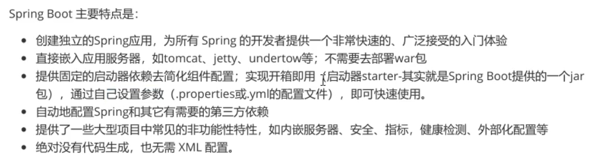

* springBoot是什么，有什么作用

  Spring boot是一个便捷的脚手架；作用是帮助开发任意快速的搭建大型spring项目。简化工程配置，以来管理；实现开发人员把时间都集中在业务开发上。

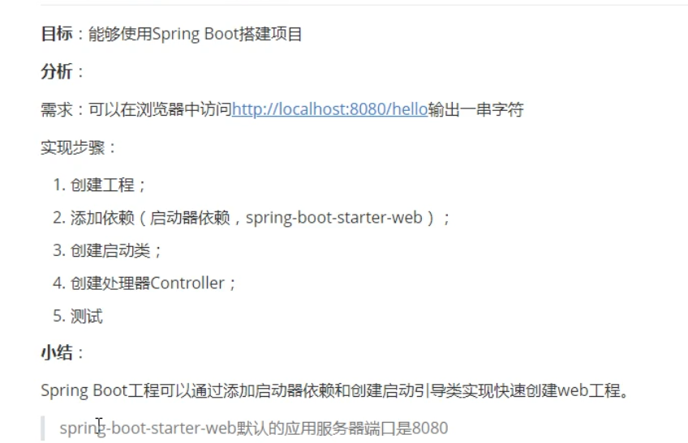

## 2.java配置应用

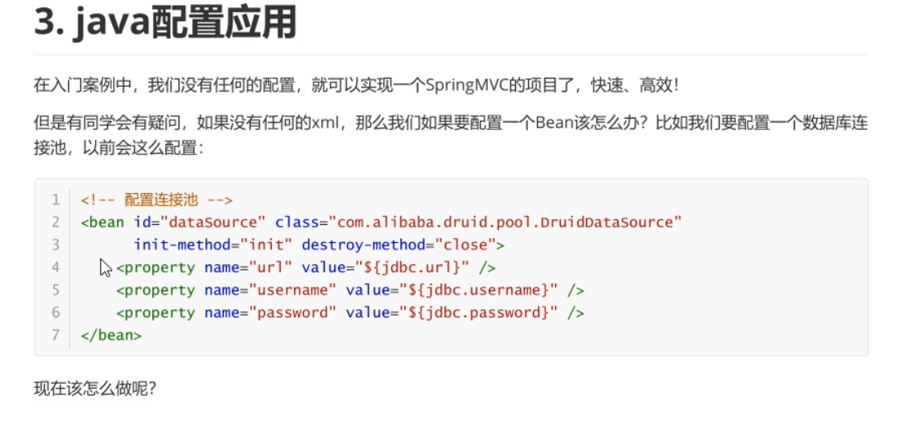

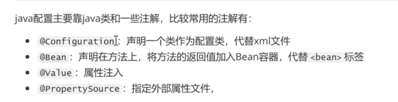 

## 3.Spring boot属性注入方式

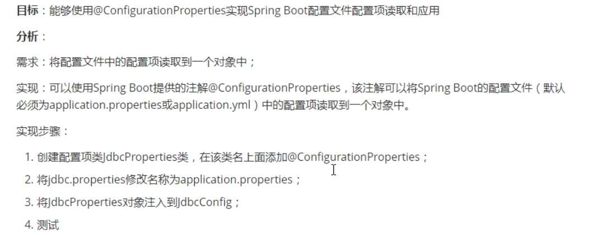

在以前我们使用

```java
@Value("${jdbc.driver}")
String driver;
@Value("${jdbc.url}")
String url;
@Value("${jdbc.user}")
String user;
@Value("${jdbc.password}")
String password;
```

这种方式将properties文件中的内容进行注入，但是这样的注入式非常的繁琐的。所以

我们将以前的jdbc.properties改名为application.properties内容是不变的

在spring配置类上加上注解@EnableConfigurationProperties(JdbcProperties.class) 其中JdbcProperties.class是我们编写的类

```java
//作用是从配置文件application配置文件中读取配置项
//其中prefix是前缀如jdbc.url中的jdbc
//配置项类中的类变量名必须要与前缀之后的配置项名称保持松散绑定（相同）
@ConfigurationProperties(prefix = "jdbc")
public class JdbcProperties {
    private String driver;
    private String url;
    private String user;
    private String password;
    //省略get和set方法
}
```

```java
@Configuration
@EnableConfigurationProperties(JdbcProperties.class)
public class JdbcConfig {
    @Bean
    public DataSource dataSource(JdbcProperties jdbcProperties) throws PropertyVetoException {
        ComboPooledDataSource comboPooledDataSource = new ComboPooledDataSource();
        comboPooledDataSource.setDriverClass(jdbcProperties.getDriver());
        comboPooledDataSource.setJdbcUrl(jdbcProperties.getUrl());
        comboPooledDataSource.setUser(jdbcProperties.getUser());
        comboPooledDataSource.setPassword(jdbcProperties.getPassword());
        return comboPooledDataSource;
    }

}
```

上面是我们的配置类

## 4.更优雅的注入方式

```java
@Bean
@ConfigurationProperties(prefix = "jdbc")
public DataSource dataSource() throws PropertyVetoException {
    ComboPooledDataSource comboPooledDataSource = new ComboPooledDataSource();

    return comboPooledDataSource;
}
```

只写这个跟application.properties就可以，不再需要编写类

## 5.多Yml文件配置

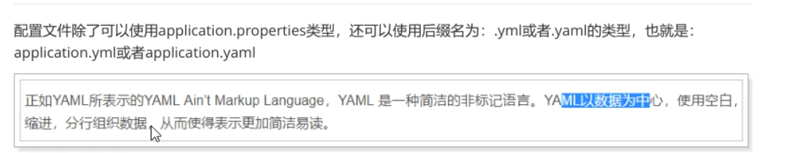

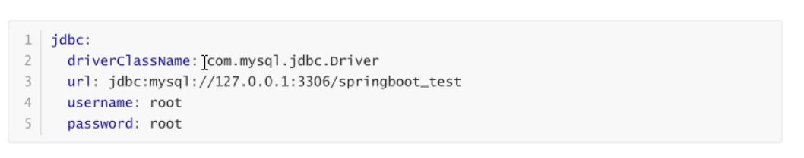

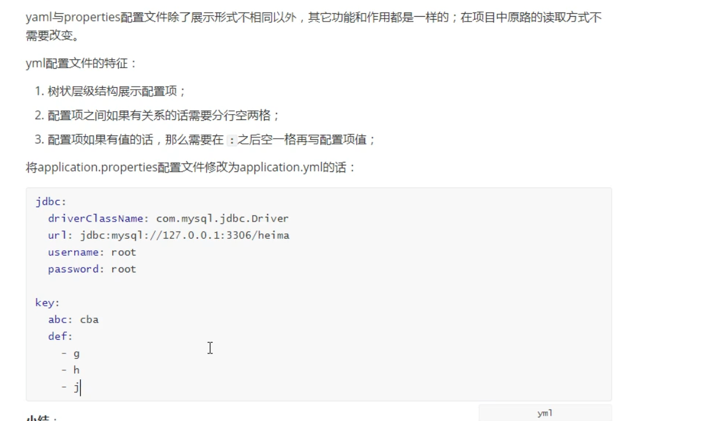

注意后面的key.def是个集合

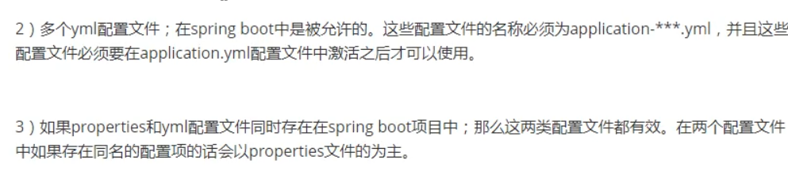

多个properties文件

主properties文件
application.yml

```yml
jdbc:
  driver: com.mysql.cj.jdbc.Driver
  url: jdbc:mysql://localhost:3306/mydb?serverTimezone=UTC
  user: root
  password: 123

#激活配置文件，指定其他配置文件名称
spring:
  profiles:
    active: abc,def//只写文件名-后面的就行
```

application-abc.yml

```yml
baoliang:
  url: http://www.baoliang.com
```

application-def.yml

```yml
xiaozhong:
  url: http://www.xiaozhong.com
```

注意文件名称都是以application为开头的

还有就是，在这里读取配置文件没有任何的注解，因为写文件名称为application.yml的时候，springboot就会认为是配置文件。

## 6.自动启动原理

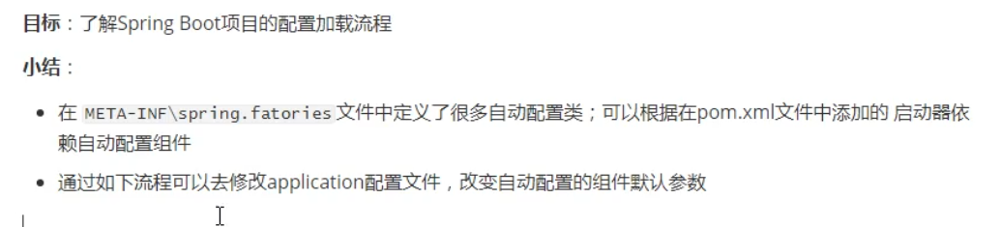

在spring boot自动整合的前提下，如何修改组件的默认值

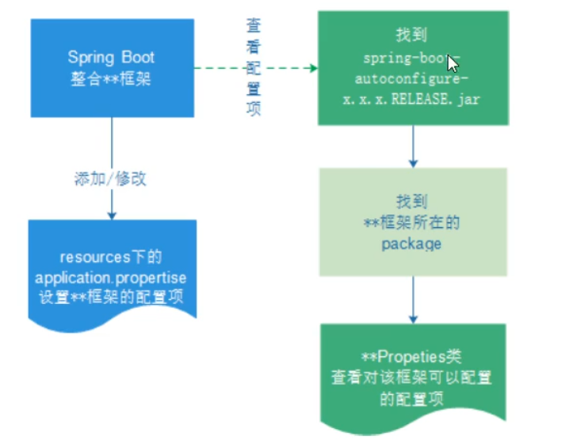


 配置文件中能配置的东西，都存在一个固有的规律

xxxxAutoConofiguration:默认值 xxxProperties 和配置文件绑定，我们就可以使用自定义的配置了。

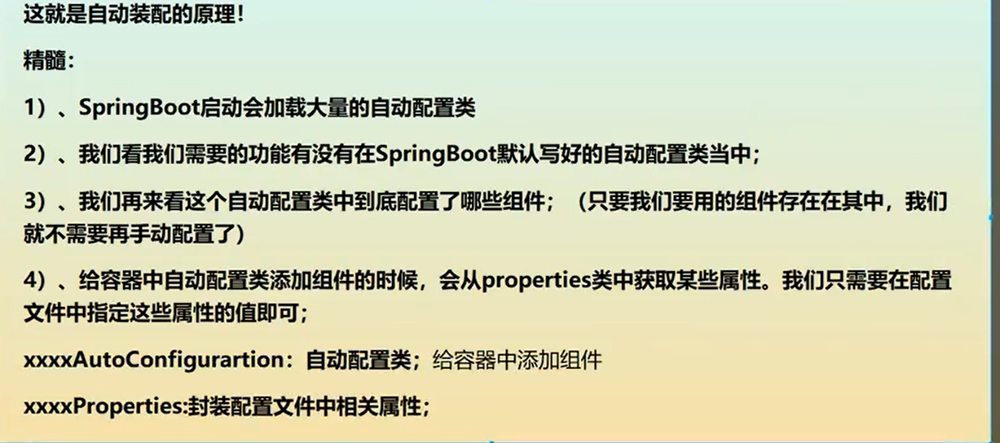

查看哪些自动类生效了

在yml中配置

debug: true

## 7.lombok应用

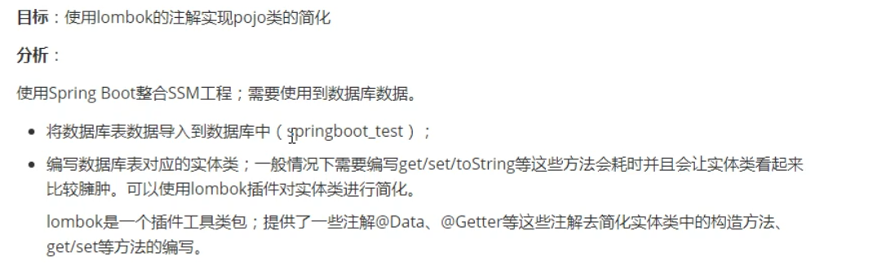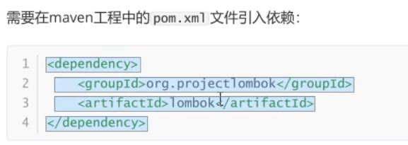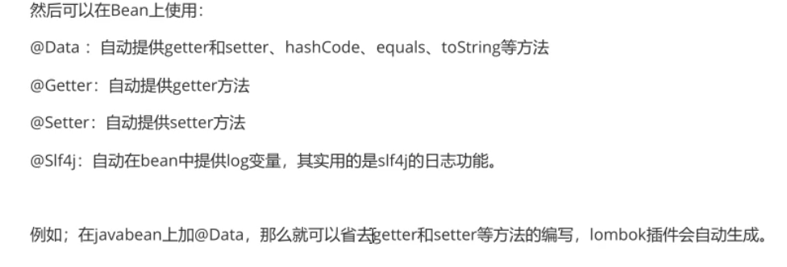

## 8.Spring Boot整合-SpringMVC端口和静态资源

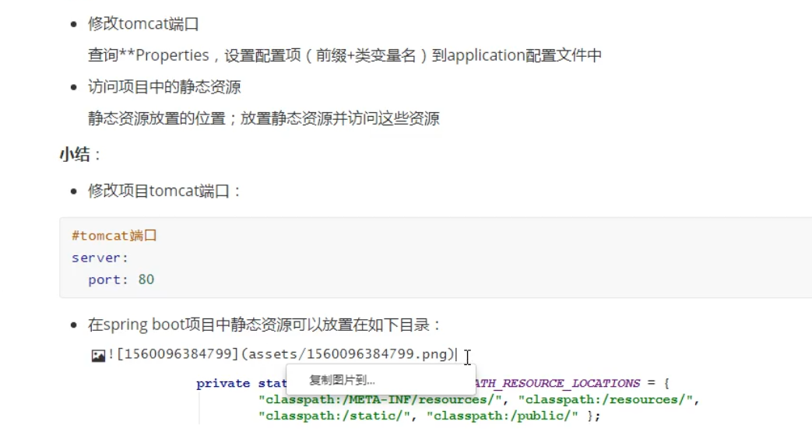


@AllArgsConstructor为有参构造

@NoArgsConstructor为无参数构造


## 9.SpringBoot整合SpringMVC拦截器


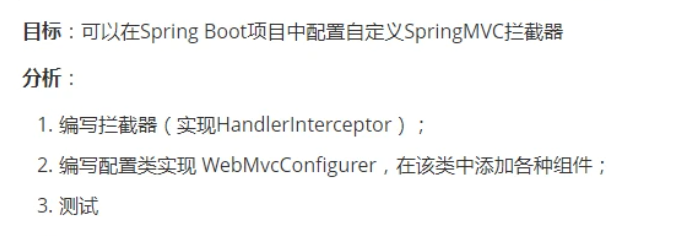


## 10.SpringBoot web开发

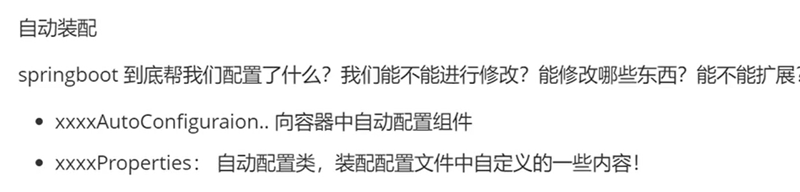

什么是webjars?

webjars可以以maven方式引入juery

## 11.首页如何定制

放在静态资源目录中命名为index.html就成为了首页

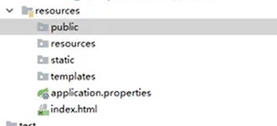

在templates目录下所有页面，只能通过controller来跳转

thymeleaf模板引擎

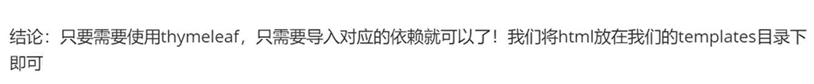

在html中导入头文件

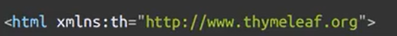

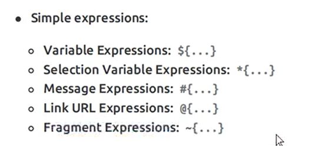

正常在html标签中

```html
<h1 text="">加上th可以取任何值<h1 th:text="${msg}"></h1>
```

所有的html元素都可以被thymeleaf替换接管 th:元素名

text会转译html，而utext不会转译

**基本语法**

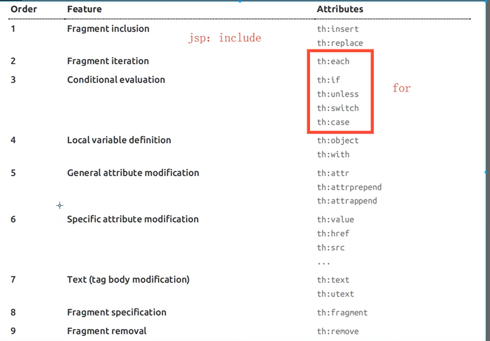

## 12. 扩展SpringMVC

创建一个类并且加入@Configuration注解不要添加@EnableWebMVC注解，实现WebMvcC onfigurer

实现了ViewResolver接口的类就可以看作视图解析器

如果想自定义一些定制化的功能只需要写这个组件，然后将它交给SPringboot,springboot就会帮我们自动装配

@EnableWebMvc：导入了一个类：DelegatingWebMvcConfiguration：从容器中获取所有的webmvcconfig

加上@EnableWebMvc SpringMvc的配置全部失效

## 13.国际化

spring.message.basename=文件前缀

一个前缀有很多的后缀文件

比如login_zh_CN.properties,login_en_US.properties

## 14. 整合Redis

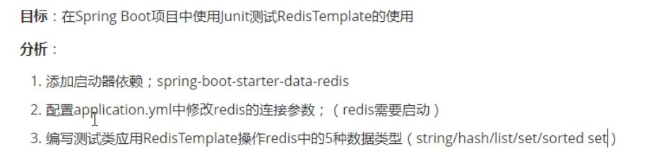